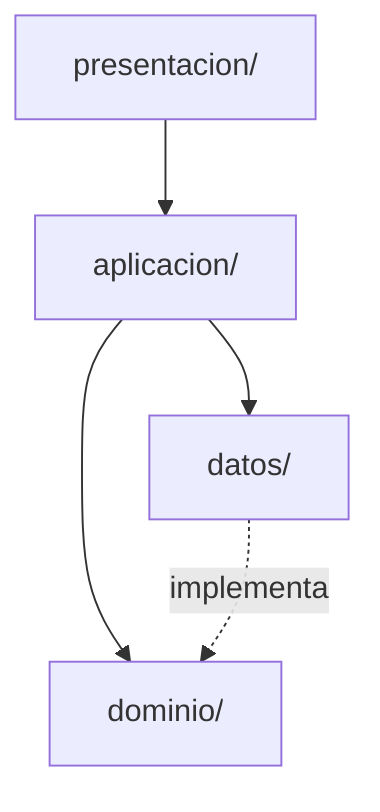

# Capsoul · Estructura del proyecto

## Árbol principal

```
capsould/
├── lib/
│   ├── main.dart                    # Arranque: Firebase (FCM) + Supabase + runApp
│   ├── app_capsoul.dart             # MaterialApp.router
│   ├── firebase_options.dart        # Generado por flutterfire (no editar)
│   ├── nucleo/                      # Código compartido entre funcionalidades
│   └── funcionalidades/             # Una carpeta por área de producto
├── test/                            # Espejo de lib/ + ayudantes/
├── supabase/
│   ├── migrations/                  # SQL versionado
│   └── functions/                   # Edge Functions Deno
├── docs/                            # Esta documentación
├── env/dev.json.example             # Plantilla de --dart-define-from-file
└── Memory.md                        # Estado vivo del código
```

## Capas por funcionalidad

Cada carpeta en `lib/funcionalidades/<nombre>/` sigue la misma separación:

| Capa | Carpeta | Responsabilidad |
|---|---|---|
| **Presentación** | `presentacion/` | Pantallas (`pantalla_*.dart`), componentes visuales, validadores de formulario |
| **Aplicación** | `aplicacion/` | Controladores Riverpod (`Notifier`), proveedores, orquestación |
| **Dominio** | `dominio/` | Entidades, interfaces `repositorio_*.dart`, fallos (`fallo_*.dart`), validadores |
| **Datos** | `datos/` | Implementaciones Supabase/Cloudinary, `acceso_tablas_*.dart`, mapeos |



## `lib/nucleo/` — servicios transversales

| Carpeta / archivo | Rol |
|---|---|
| `arranque/app_error_arranque.dart` | Pantalla de error si falla Supabase al iniciar |
| `firebase/arranque_firebase.dart` | `Firebase.initializeApp()` |
| `firebase/servicio_notificaciones_push.dart` | Token FCM (Android/iOS, no bloquea) |
| `supabase/arranque_supabase.dart` | `Supabase.initialize()` |
| `supabase/configuracion_supabase.dart` | Lee `SUPABASE_URL` y `SUPABASE_ANON_KEY` |
| `enrutador/enrutador_app.dart` | `go_router`, `StatefulShellRoute` (4 pestañas) |
| `enrutador/rutas_app.dart` | Constantes de rutas |
| `tema/colores_app.dart`, `tema_app.dart` | Design tokens Material 3 |
| `errores/fallo_app.dart` | Errores con mensaje al usuario |
| `componentes/` | Botones, avisos, frasco luminoso (reutilizables) |

## Funcionalidades implementadas

| Carpeta | Pantallas principales | Datos |
|---|---|---|
| `autenticacion/` | login, registro, recuperar, revisa correo | `RepositorioAutenticacionSupabase` |
| `usuarios/` | (sin pantalla propia) | `RepositorioUsuariosSupabase`, perfil en tabla `usuarios` |
| `perfil/` | `pantalla_perfil.dart` (pestaña Yo) | Usa proveedores de usuarios, inicio y momentos |
| `inicio/` | `pantalla_inicio.dart` | `RepositorioResumenInicioSupabase` |
| `momentos/` | listado feed, nuevo, detalle | `RepositorioMomentosSupabase` |
| `recuerdos/` | banco, detalle, elegir, guardar | `RepositorioRecuerdosSupabase` |
| `elementos/` | capturar foto/video/audio, escribir nota | `RepositorioMediosCloudinary` |
| `capsulas/` | crear, mis cápsulas, detalle | `RepositorioCapsulasSupabase` |
| `crear/` | selector Crear (desde `+`) | — |
| `legado/` | `pantalla_legado.dart` (placeholder) | Pendiente herencias |
| `navegacion/` | `contenedor_navegacion.dart` | Barra inferior 5 zonas |

## Dónde encontrar cada cosa

| Necesito… | Ubicación |
|---|---|
| Diseño de una pantalla | `lib/funcionalidades/<area>/presentacion/pantalla_*.dart` |
| Componente de una sola pantalla | `lib/funcionalidades/<area>/presentacion/componentes/` |
| Componente reutilizado | `lib/nucleo/componentes/` |
| Lógica de estado / providers | `lib/funcionalidades/<area>/aplicacion/` |
| Modelo de negocio | `lib/funcionalidades/<area>/dominio/` |
| Consultas a Postgres | `lib/funcionalidades/<area>/datos/acceso_tablas_*.dart` |
| Esquema de BD | `supabase/migrations/` y `docs/modelo_er.md` |
| Tema y colores | `lib/nucleo/tema/` |
| Rutas | `lib/nucleo/enrutador/rutas_app.dart` |

## Navegación (barra inferior)

| Posición | Etiqueta | Rama shell | Ruta |
|---|---|---|---|
| 0 | Inicio | 0 | `/inicio` |
| 1 | Momentos | 1 | `/momentos` |
| 2 | + (Crear) | — | `push /crear` |
| 3 | Mi legado | 2 | `/legado` |
| 4 | Yo | 3 | `/yo` |

El `+` no conserva estado: abre el selector de Crear encima del shell.
