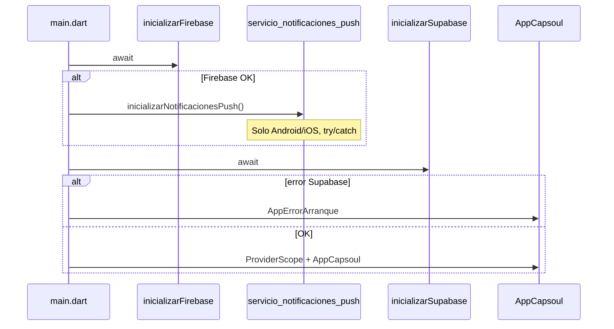
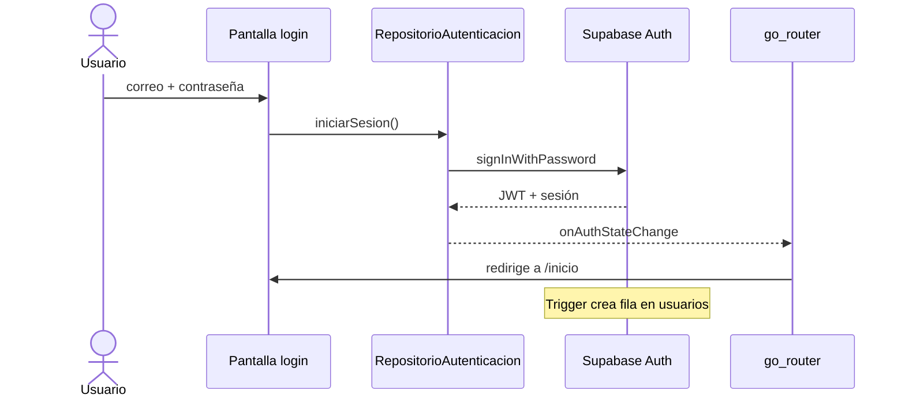
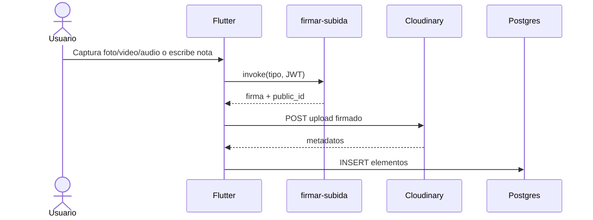
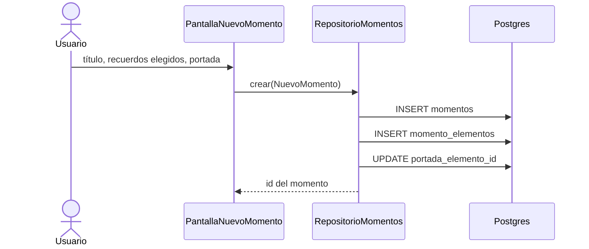

# Capsoul · Flujos críticos

## 1. Arranque de la app

**Archivos:** `lib/main.dart`, `lib/nucleo/firebase/`, `lib/nucleo/supabase/arranque_supabase.dart`

## 2. Autenticación y sesión

- Sin sesión → rutas de auth (`/iniciar-sesion`, `/registro`, …).
- Con sesión → shell principal (`/inicio`, …).
- **Archivos:** `funcionalidades/autenticacion/`, `nucleo/enrutador/enrutador_app.dart`

## 3. Subida de un medio (recuerdo)

**Archivos:** `funcionalidades/elementos/`, `funcionalidades/recuerdos/`, `supabase/functions/firmar-subida/`

## 4. Apertura de cápsula (destinatario)

1. `rpc capsulas_recibidas()` — feed sin título hasta liberar.
2. Tras `fecha_apertura`, estado `liberada`.
3. `select` cápsula + elementos (RLS).
4. `firmar-medio` → URL temporal → reproducción.
5. `rpc marcar_capsula_abierta(id)`.

Ver diagrama completo en [arquitectura.md](arquitectura.md) sección 4.

## 5. Crear un momento

**Archivos:** `funcionalidades/momentos/`, tabla `momentos` + `momento_elementos`

## 6. Perfil vs pestaña Momentos (UI)

| Pantalla | Comportamiento |
|---|---|
| **Yo (Perfil)** | Cabecera Instagram + destacados + búsqueda/filtros + rejilla 2 columnas de momentos |
| **Momentos** | Feed vertical: cada tarjeta = un momento con carrusel horizontal de recuerdos |

Ambas leen `proveedorMomentos`; el filtro en memoria (`proveedorFiltroMomentos`) solo aplica en Perfil.
