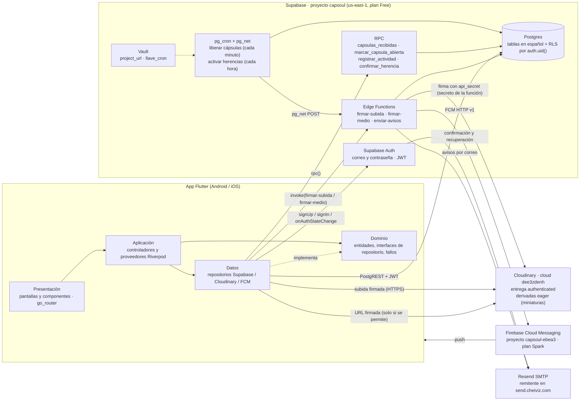
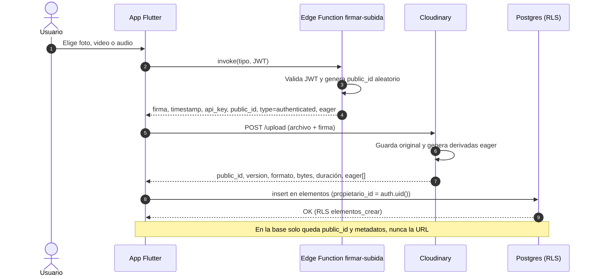
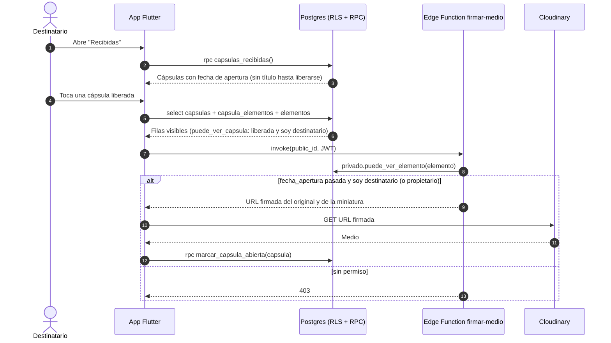
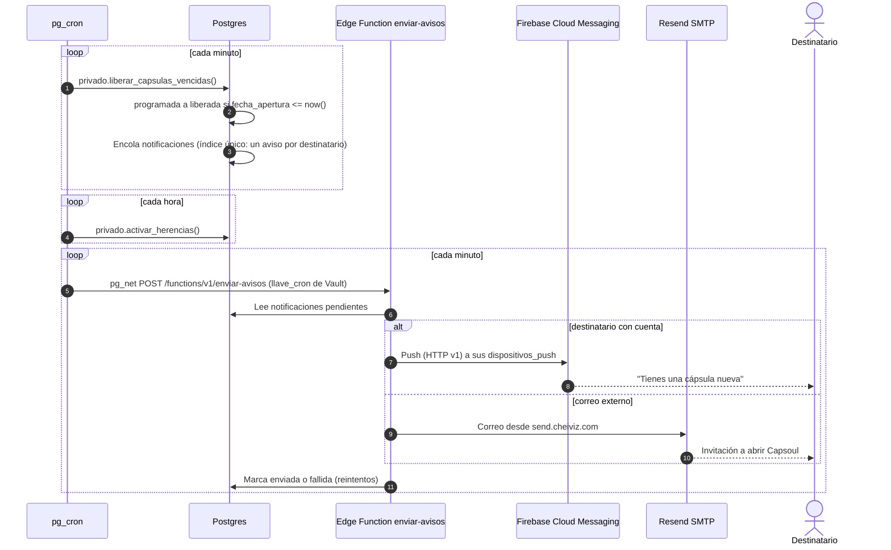

# Capsoul · Arquitectura e infraestructura (ARQ-2)

> Versión 2.0 · 2026-10-02 · Reemplaza la versión basada en Firebase (Auth, Firestore, Storage y Cloud Functions).
> Decisión del PO: **Supabase** (Auth, Postgres con RLS, RPC, Edge Functions, Cron) + **Cloudinary** (medios privados).
> **Firebase queda solo para FCM**, en plan **Spark**. Modelo de datos: [`docs/modelo_er.md`](modelo_er.md).
> Migraciones: [`supabase/migrations/`](../supabase/migrations/).

## 1. Vista general

## 2. Componentes

| Componente | Responsabilidad | Notas de seguridad |
|---|---|---|
| **App Flutter** | Capas presentación → aplicación → dominio ← datos. Riverpod inyecta repositorios detrás de interfaces (`RepositorioAutenticacion`, `RepositorioUsuarios`…); go_router redirige según la sesión (`onAuthStateChange`). | Solo usa la clave publicable (anon/publishable) por `--dart-define-from-file`. Nunca `service_role`, `sb_secret_` ni el `api_secret` de Cloudinary. |
| **Supabase Auth** | Registro, inicio de sesión, confirmación de correo, recuperación de contraseña, JWT. | El trigger `auth_usuarios_1_crear_perfil` crea la fila `usuarios`; `auth_usuarios_3_sincronizar_correo` mantiene `usuarios.correo` al día. |
| **Postgres + RLS** | Datos relacionales (usuarios, amistades, elementos, cápsulas, destinatarios, momentos, herencias, retos, notificaciones). | RLS en todas las tablas. `usuarios` solo deja leer la fila propia; terceros ven `perfiles_visibles` (sin correo). Las funciones de `privado` solo las ejecuta `authenticated` cuando las usa una política. |
| **RPC** | Lecturas y acciones que RLS no expresa bien: feed de recibidas sin revelar el contenido, marcar abierta, latido de actividad, confirmar herencia. | `SECURITY DEFINER` con `search_path` vacío; EXECUTE solo para `authenticated`. |
| **Edge Function `firmar-subida`** | Devuelve una firma de subida a Cloudinary: `type=authenticated`, `public_id` aleatorio, carpeta por usuario, transformaciones *eager* fijas (miniatura y versión comprimida). | Guarda `api_key`/`api_secret` como secretos de la función. Firma válida 1 hora. Nunca se usa un preset sin firmar. |
| **Edge Function `firmar-medio`** | Devuelve URLs firmadas de un `public_id` (original o derivada *eager*). | Firma solo si `privado.puede_ver_elemento()` es verdadero para el JWT: en cápsulas, solo después de `fecha_apertura` (cápsula `liberada`) y solo a destinatarios; el propietario ve su propio medio (supuesto 12). |
| **Edge Function `enviar-avisos`** | Consume `notificaciones` pendientes y envía push (FCM HTTP v1) o correo (Resend), con reintentos. | La invoca pg_cron con `llave_cron` desde Vault. |
| **pg_cron + pg_net** | `liberar_capsulas_vencidas()` cada minuto, `activar_herencias()` cada hora, `enviar-avisos` cada minuto. | En plan Free, si el proyecto se pausa, no corre (riesgo aceptado, D1). |
| **Cloudinary** | Almacena y entrega fotos, video y audio. | Entrega `authenticated`: sin URL pública ni transformaciones al vuelo; en Postgres solo se guarda `public_id` y metadatos. |
| **Firebase (solo FCM)** | Notificaciones push a Android/iOS. | Plan Spark, sin Auth/Firestore/Storage. Tokens en `dispositivos_push`. |
| **Resend (SMTP)** | Correos de Supabase Auth (confirmación, recuperación) y avisos a destinatarios externos. | Remitente en `send.cheiviz.com`. La API key vive **solo** en Supabase (SMTP de Auth y secretos de Edge Functions), nunca en la app ni en el repo. |

## 3. Flujo: subida de un medio

## 4. Flujo: apertura de una cápsula

## 5. Flujo: liberación programada

## 6. Capas de la app

| Capa | Carpeta | Contenido |
|---|---|---|
| Presentación | `lib/funcionalidades/*/presentacion/` | Pantallas, componentes, validadores de formulario. Solo hablan con controladores. |
| Aplicación | `lib/funcionalidades/*/aplicacion/` | Controladores (`Notifier`) y proveedores Riverpod que inyectan repositorios. |
| Dominio | `lib/funcionalidades/*/dominio/` | Entidades (`UsuarioApp`, `PerfilUsuario`), interfaces de repositorio y fallos con mensaje en español. Sin dependencias de Supabase. |
| Datos | `lib/funcionalidades/*/datos/` | `RepositorioAutenticacionSupabase`, `RepositorioUsuariosSupabase` + `AccesoTablaUsuarios` (y, más adelante, elementos con Cloudinary y FCM). |
| Núcleo | `lib/nucleo/` | Arranque (`inicializarSupabase`, `inicializarFirebase` para FCM, `AppErrorArranque`), enrutador, tema, errores y componentes compartidos. |

## 7. Configuración y secretos

| Dato | Dónde vive |
|---|---|
| `SUPABASE_URL`, `SUPABASE_ANON_KEY` (publicable) | `env/dev.json` local (ignorado) → `--dart-define-from-file` |
| `api_key` / `api_secret` de Cloudinary | Secretos de las Edge Functions `firmar-subida` y `firmar-medio` |
| API key de Resend | Supabase → Authentication → SMTP (y secreto de `enviar-avisos`) |
| `project_url`, `llave_cron` | Supabase Vault (los lee pg_cron) |
| Credencial de FCM HTTP v1 | Secreto de `enviar-avisos` |
| `firebase_options.dart`, `google-services.json` | Repo (claves de cliente de Firebase, no secretas) |

## 8. Pendiente

- Edge Functions `firmar-subida`, `firmar-medio` y `enviar-avisos` (no existen aún).
- Aplicar migraciones, SMTP con Resend y bajar Firebase a Spark: requieren aprobación del PO (regla 7 de `Memory.md`).
- `firestore.rules` y `firebase.json` quedan obsoletos (borrado propuesto al PO).
