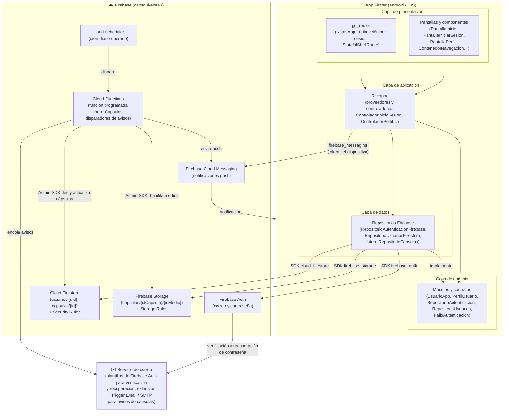
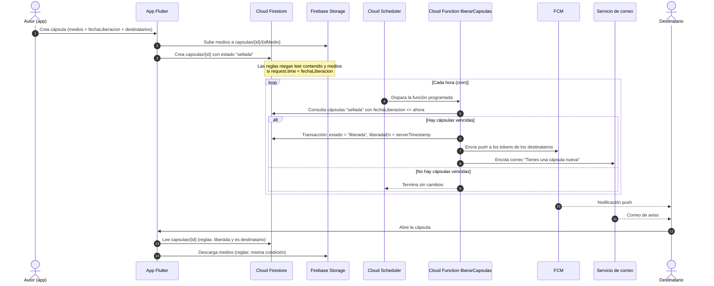

# Arquitectura de Capsoul (ARQ-2)

> Documento vivo. Describe la arquitectura de la app Flutter y la infraestructura serverless de Firebase
> (proyecto `capsoul-ebea3`). Última actualización: 2026-09-26.

## 1. Vista general

Capsoul es una app Flutter (Android e iOS) sin servidor propio: toda la persistencia, autenticación,
lógica programada y notificaciones viven en Firebase. La app sigue una estructura por funcionalidades
(`lib/funcionalidades/<funcionalidad>/`) con cuatro capas y código compartido en `lib/nucleo/`.

## 2. Flujo de liberación de una cápsula

La liberación nunca depende del reloj del teléfono: las Security Rules comparan `fechaLiberacion` con
`request.time` y una Cloud Function programada cambia el estado y avisa a los destinatarios.

## 3. Componentes

| Componente | Responsabilidad |
|---|---|
| **Capa de presentación** (`presentacion/`) | Pantallas y componentes en español con el tema de marca (`TemaApp`, `ColoresApp`). No llama a Firebase: solo lee y dispara acciones de los proveedores. |
| **go_router** (`lib/nucleo/enrutador/`) | Rutas en español (`/inicio`, `/momentos`, `/crear`, `/legado`, `/yo`, `/iniciar-sesion`, `/registro`, `/recuperar`). `StatefulShellRoute` conserva el estado de cada pestaña; la redirección envía a `/iniciar-sesion` sin sesión y al contenedor principal con sesión. El `+` hace *push* de `/crear`. |
| **Capa de aplicación** (`aplicacion/`) | Proveedores y controladores de Riverpod (`Notifier` con estados cargando / datos / error). Orquestan casos de uso: registrar usuario y crear su perfil, iniciar sesión, recuperar contraseña, editar perfil. |
| **Capa de dominio** (`dominio/`) | Modelos inmutables (`UsuarioApp`, `PerfilUsuario`), contratos abstractos (`RepositorioAutenticacion`, `RepositorioUsuarios`) y fallos con mensaje en español (`FalloAutenticacion`, `FalloPerfilUsuario`). No depende de Firebase. |
| **Capa de datos** (`datos/`) | Implementaciones de los contratos con los SDK de Firebase. Traducen excepciones de Firebase a fallos de dominio. Se inyectan por proveedores para poder simularlas en pruebas. |
| **Firebase Auth** | Cuentas con correo y contraseña, sesión persistente (`authStateChanges`), verificación de correo y restablecimiento de contraseña. |
| **Cloud Firestore** | Datos estructurados con campos en español: `usuarios/{uid}` (`nombreVisible`, `correo`, `fotoUrl`, `creadoEn`) y, desde el S4, `capsulas/{id}` (`idDueno`, `idsDestinatarios`, `fechaLiberacion`, `estado`, `privacidad`). Las Security Rules son la fuente de verdad (deny by default). |
| **Firebase Storage** | Medios de las cápsulas (video, audio, foto) en `capsulas/{idCapsula}/{idMedio}`, protegidos con la misma condición de liberación que Firestore. |
| **Cloud Functions** | Lógica privilegiada con Admin SDK: función programada `liberarCapsulas` (vía Cloud Scheduler) que marca como liberadas las cápsulas vencidas y dispara los avisos; limpieza de medios al borrar cápsulas. Nunca se incrustan credenciales de administrador en la app. |
| **FCM** | Notificaciones push a los destinatarios cuando una cápsula se libera (tokens por usuario, sin temas globales que filtren datos). |
| **Servicio de correo** | Correos de verificación y recuperación con las plantillas de Firebase Auth (en español); avisos de cápsulas liberadas mediante la extensión *Trigger Email* o un proveedor SMTP llamado desde Cloud Functions. |

## 4. Estado actual (Sprint 2)

- Implementado: capas de presentación, aplicación, dominio y datos para autenticación y perfil;
  Firebase Auth; Firestore `usuarios/{uid}` con reglas de dueño.
- Pendiente (S4 en adelante): `capsulas/{id}`, Storage con reglas de liberación, Cloud Functions
  (`functions/`), FCM y avisos por correo.
