# Capsoul · Modelo Entidad-Relación (Supabase / Postgres)

| Campo | Valor |
|---|---|
| Documento | 13 · Modelo Entidad-Relación |
| Fecha | 2026-10-03 |
| Versión | 1.3 (1.2 del 2026-10-02 + permisos por defecto globales y vinculación de invitaciones al cambiar el correo, aprobados por el PO el 2026-10-03) |
| Estado | **Borrador para revisión** del PO y de Flutter Dev. La migración no se ha aplicado en ningún proyecto |
| Relacionado | ARQ-3 ([DEV-91](https://linear.app/fabrica-de-software-uac/issue/DEV-91)); documentos 05 (Arquitectura) y 12 (Decisión de migración) |
| Archivos | `20261002000001_capsoul_modelo_inicial.sql`, `20261002000002_capsoul_programar_trabajos.sql`, `pruebas_rls_capsoul.sql` y `13-Modelo-Entidad-Relacion.mmd` en la carpeta de documentos |

> Origen: decisión del PO del 2026-10-02 (Supabase/Postgres + Cloudinary) y su lista de entidades: usuarios, cápsulas, elementos, momentos, herencias, retos y red de amistades cercanas, donde "la mayoría de tablas consumen de elementos". El diagrama original del PO no estaba disponible como archivo en el repositorio ni en Drive; este modelo parte de esa lista de entidades y de los requisitos de los documentos 02 y 03. Las cardinalidades ambiguas se resolvieron con supuestos (sección 6), que el PO debe confirmar.

## 0. Decisiones del PO que afectan el modelo (2026-10-02)

Registro completo en el documento 12, sección "Decisiones del PO".

| # | Decisión | Efecto en este modelo |
|---|---|---|
| D1 | Plan Free de Supabase; el PO acepta el riesgo de pausa (R1) | Ninguno en el esquema. Mientras el proyecto esté pausado, `pg_cron` no libera cápsulas |
| D2 | Medios privados: entrega `authenticated`, subida firmada desde una Edge Function, `public_id` aleatorio, URLs firmadas solo después de `fecha_apertura` y solo para destinatarios, nunca preset sin firmar | `elementos.cloudinary_tipo_entrega` solo admite `'authenticated'` (CHECK). Se **elimina** la columna `url_segura`: en la base solo queda el `public_id` y sus metadatos. El `public_id` lo fija `firmar-subida` (aleatorio, sin uid ni nombre de archivo). La Edge Function `firmar-medio` firma solo si `privado.puede_ver_elemento()` lo permite. Para un medio de cápsula, esa función exige que la cápsula esté `liberada` y que quien pide sea destinatario (vía `puede_ver_capsula`). **Supuesto 12 (confirmado por el PO el 2026-10-03):** el propietario del elemento conserva el acceso a su propio medio antes de la apertura (`es_mi_elemento`), y los medios de momentos, herencias y retos siguen sus propias reglas. La URL firmada (`private_download_url`) vence a la hora (`expires_at` = 1 h) |
| D3 | SMTP con Resend (`send.cheiviz.com`) | Ninguno en el esquema. Hace viable el aviso por correo a destinatarios externos (`notificaciones.canal = 'correo'`) |
| D4 | Firebase baja a Spark y queda solo FCM | Ninguno: `dispositivos_push` ya guarda tokens de FCM |
| D5 | R3 cerrado (2026-10-03): la confirmación de correo es **obligatoria** ("Confirm email" activo en Supabase Auth) | Toda cuenta con sesión tiene `email_confirmed_at`; el supuesto 10 (vincular invitados externos solo con correo confirmado) queda garantizado |

> Verificado otra vez en el Postgres 17 local tras el cambio de D2: la migración `000001` corre sin errores, `pruebas_rls_capsoul.sql` da los mismos resultados de la sección 7, y un INSERT con `cloudinary_tipo_entrega = 'upload'` lo rechaza el CHECK `elementos_cloudinary_tipo_entrega_check`.
>
> **Correcciones 1.2 aprobadas por el PO (2026-10-02):**
> - **Correo privado:** `usuarios_leer` solo deja leer la fila propia (completa, con `correo`). Los perfiles de amigos (amistad aceptada) y los públicos se leen por la vista `public.perfiles_visibles` (`id`, `nombre_visible`, `foto_public_id`, `perfil_publico`), sin `correo`. La vista es `security_invoker` y lee de `privado.perfiles_visibles()` (SECURITY DEFINER, `search_path` vacío), que aplica las mismas reglas de visibilidad.
> - **Correo sincronizado:** el trigger `auth_usuarios_3_sincronizar_correo` (AFTER UPDATE OF email ON `auth.users`) copia el nuevo correo a `usuarios.correo`.
> - **Mínimo privilegio en `privado`:** al final de la migración se revoca EXECUTE a `public`, `anon` y `authenticated`, y solo se devuelve a `authenticated` en las funciones que usan las políticas RLS y la vista. Los trabajos del servidor solo los ejecuta `service_role`/`postgres`.
> - Verificado en un Postgres 17 local desechable: migración sin errores y `pruebas_rls_capsoul.sql` con los resultados de la sección 7 (incluidas las pruebas nuevas de correo privado).
>
> **Correcciones 1.3 aprobadas por el PO (2026-10-03):**
> - **Permisos por defecto globales:** en la sección 9 se añade `alter default privileges for role postgres revoke execute on functions from public;` (sin `in schema`). En Postgres el EXECUTE de PUBLIC sobre funciones es un permiso por defecto **global**: la variante `... in schema privado revoke ... from public` no lo quita (comprobado en Postgres 17: la función nueva seguía ejecutable por `anon`). La forma global sí cubre toda función futura creada por `postgres` (el rol que aplica las migraciones en Supabase). En `public` no rompe nada: Supabase otorga por defecto EXECUTE a `anon`/`authenticated`/`service_role` en ese esquema, y las RPC del modelo llevan grants explícitos.
> - **Vinculación al cambiar el correo:** la lógica de vincular invitaciones (cápsulas y herencias dirigidas a un correo externo) se extrae a `privado.vincular_invitaciones_correo(uuid, text)`, que usan `auth_usuarios_2_vincular_correo` (al confirmar) y `auth_usuarios_3_sincronizar_correo` (al cambiar el correo, además de copiarlo a `usuarios.correo`). Criterio: solo si la cuenta tiene `email_confirmed_at`; con *Secure email change* Supabase solo escribe `auth.users.email` después de que el usuario confirma el correo nuevo. Es idempotente y no desvincula lo ya vinculado.
> - Verificado en un Postgres 17 local desechable: migración sin errores y `pruebas_rls_capsoul.sql` con los resultados de la sección 7 (incluidas las pruebas nuevas de 1.3).

> Pendiente: las miniaturas. Un recurso `authenticated` no admite transformaciones al vuelo; las derivadas (miniatura, versión comprimida) se generan como *eager* en la subida firmada, y cada una lleva su propia firma ([Cloudinary: authenticated](https://cloudinary.com/documentation/control_access_to_media#authenticated_media_assets)). `miniatura_public_id` queda como metadato opcional.

## 1. Principios del modelo

1. **Nombres en español y snake_case**, según la regla 6 de `Memory.md`. Así se unifica la nomenclatura que ARQ-3 tenía pendiente (`unlockAt`/`fechaLiberacion`/`unlockDate` pasan a `fecha_apertura`).
2. **`elementos` es la tabla central de medios.** Guarda el tipo y la referencia de Cloudinary (`cloudinary_public_id`, tipo de recurso, tipo de entrega y versión), **nunca el archivo**. Cápsulas, momentos y herencias la consumen con tablas intermedias N:M, y las entregas de retos con una FK.
3. **RLS en todas las tablas** (15 de 15). El cliente usa la llave publicable, así que RLS es la fuente de verdad, igual que antes lo eran las Security Rules.
4. **Solo el servidor libera.** Los triggers impiden que un usuario `authenticated` ponga una cápsula en `liberada` o active una herencia. La liberación la hacen funciones `SECURITY DEFINER` que programa `pg_cron`.
5. **Idempotencia.** Una cápsula pasa una sola vez de `programada` a `liberada` (UPDATE condicionado al estado), y los avisos tienen un índice único por evento y destinatario (DEV-99 y DEV-100).
6. **Las funciones auxiliares de RLS van en el esquema `privado`**, que la API no expone. Eso evita la recursión entre políticas y que esas funciones se llamen por RPC.

## 2. Diagrama entidad-relación

Notación de Mermaid: `||--o{` = uno a cero o muchos; `||--|{` = uno a uno o muchos; `|o--o{` = cero o uno a cero o muchos.

```mermaid
erDiagram
    USUARIOS ||--o{ DISPOSITIVOS_PUSH : "registra"
    USUARIOS ||--o{ AMISTADES : "solicita"
    USUARIOS ||--o{ AMISTADES : "recibe"
    USUARIOS ||--o{ ELEMENTOS : "es propietario de"
    USUARIOS ||--o{ CAPSULAS : "escribe"
    CAPSULAS ||--o{ CAPSULA_ELEMENTOS : "contiene"
    ELEMENTOS ||--o{ CAPSULA_ELEMENTOS : "se usa en"
    CAPSULAS ||--|{ CAPSULA_DESTINATARIOS : "se entrega a"
    USUARIOS |o--o{ CAPSULA_DESTINATARIOS : "es destinatario"
    USUARIOS ||--o{ MOMENTOS : "publica"
    MOMENTOS ||--o{ MOMENTO_ELEMENTOS : "contiene"
    ELEMENTOS ||--o{ MOMENTO_ELEMENTOS : "se usa en"
    USUARIOS ||--o{ HERENCIAS : "deja"
    USUARIOS |o--o{ HERENCIAS : "es beneficiario"
    USUARIOS |o--o{ HERENCIAS : "es persona de confianza"
    HERENCIAS ||--o{ HERENCIA_ELEMENTOS : "contiene"
    ELEMENTOS ||--o{ HERENCIA_ELEMENTOS : "se usa en"
    USUARIOS ||--o{ RETOS : "crea"
    RETOS ||--o{ RETO_PARTICIPANTES : "tiene"
    USUARIOS ||--o{ RETO_PARTICIPANTES : "participa"
    RETOS ||--o{ RETO_ENTREGAS : "recibe"
    USUARIOS ||--o{ RETO_ENTREGAS : "entrega"
    ELEMENTOS |o--o{ RETO_ENTREGAS : "evidencia"
    USUARIOS |o--o{ NOTIFICACIONES : "recibe"

    USUARIOS {
        uuid id PK "FK a auth.users"
        text nombre_visible "1 a 60"
        text correo UK "privado: solo el dueno"
        text foto_public_id "Cloudinary, opcional"
        boolean perfil_publico "false por defecto"
        timestamptz ultima_actividad_en
        timestamptz creado_en
        timestamptz actualizado_en
    }
    DISPOSITIVOS_PUSH {
        uuid id PK
        uuid usuario_id FK
        text token_fcm UK
        text plataforma "android o ios"
        timestamptz ultimo_uso_en
    }
    AMISTADES {
        uuid id PK
        uuid solicitante_id FK
        uuid receptor_id FK
        estado_amistad estado "pendiente aceptada rechazada bloqueada"
        boolean cercano_para_solicitante
        boolean cercano_para_receptor
        timestamptz respondido_en
    }
    ELEMENTOS {
        uuid id PK
        uuid propietario_id FK
        tipo_elemento tipo "foto video audio texto"
        text contenido_texto "solo texto"
        text cloudinary_public_id UK
        text cloudinary_tipo_recurso "image video raw"
        text cloudinary_tipo_entrega "solo authenticated"
        bigint cloudinary_version
        bigint bytes
        numeric duracion_segundos
        text miniatura_public_id
    }
    CAPSULAS {
        uuid id PK
        uuid autor_id FK
        text titulo
        text mensaje
        timestamptz fecha_apertura
        estado_capsula estado "borrador programada liberada cancelada"
        timestamptz liberada_en
    }
    CAPSULA_ELEMENTOS {
        uuid capsula_id PK, FK
        uuid elemento_id PK, FK
        smallint orden
    }
    CAPSULA_DESTINATARIOS {
        uuid id PK
        uuid capsula_id FK
        uuid usuario_id FK "o correo externo"
        text correo_externo
        timestamptz notificado_en
        timestamptz abierta_en
    }
    MOMENTOS {
        uuid id PK
        uuid autor_id FK
        text texto
        visibilidad_momento visibilidad "privado cercanos amigos"
    }
    MOMENTO_ELEMENTOS {
        uuid momento_id PK, FK
        uuid elemento_id PK, FK
        smallint orden
    }
    HERENCIAS {
        uuid id PK
        uuid propietario_id FK
        text titulo
        uuid beneficiario_usuario_id FK "o correo externo"
        text beneficiario_correo
        uuid persona_confianza_id FK
        condicion_herencia condicion_activacion "fecha inactividad confirmacion_confianza"
        timestamptz fecha_activacion
        integer dias_inactividad
        estado_herencia estado "borrador activa en_verificacion liberada revocada"
        timestamptz liberada_en
    }
    HERENCIA_ELEMENTOS {
        uuid herencia_id PK, FK
        uuid elemento_id PK, FK
        smallint orden
    }
    RETOS {
        uuid id PK
        uuid creador_id FK
        text titulo
        frecuencia_reto frecuencia "unica diaria semanal"
        date fecha_inicio
        date fecha_fin
    }
    RETO_PARTICIPANTES {
        uuid reto_id PK, FK
        uuid usuario_id PK, FK
        estado_participacion estado "invitado aceptado abandonado"
    }
    RETO_ENTREGAS {
        uuid id PK
        uuid reto_id FK
        uuid usuario_id FK
        uuid elemento_id FK "opcional"
        date fecha "una por dia"
    }
    NOTIFICACIONES {
        uuid id PK
        uuid usuario_id FK "o correo_destino"
        canal_notificacion canal "push correo"
        tipo_notificacion tipo
        uuid referencia_id
        estado_notificacion estado "pendiente enviada fallida"
        smallint intentos
    }
```



## 3. Tablas y columnas

### 3.1 `usuarios` (1:1 con `auth.users`)
| Columna | Tipo | Reglas |
|---|---|---|
| `id` | uuid | **PK**, **FK** → `auth.users.id` (on delete cascade) |
| `nombre_visible` | text | NOT NULL, de 1 a 60 caracteres (la misma regla que tenía `firestore.rules`) |
| `correo` | text | NOT NULL; índice único sobre `lower(correo)`. **Privado:** solo lo lee el dueño; se sincroniza con `auth.users.email` |
| `foto_public_id` | text | Avatar en Cloudinary (backlog RF-32) |
| `perfil_publico` | boolean | `false` por defecto (RNF-23: reservado por defecto) |
| `ultima_actividad_en` | timestamptz | La alimenta la RPC `registrar_actividad()`; se usa en las herencias por inactividad |
| `creado_en`, `actualizado_en` | timestamptz | `now()`; trigger de actualización |

La fila se crea **automáticamente** con un trigger sobre `auth.users` (`privado.crear_perfil_usuario`), que lee `nombre_visible` de los metadatos del registro. El cliente solo puede actualizar `nombre_visible`, `foto_public_id` y `perfil_publico` (GRANT por columna), lo que equivale al `affectedKeys().hasOnly(['nombreVisible'])` de las reglas actuales. Cada usuario solo lee su propia fila; para ver a amigos y perfiles públicos se usa la vista `public.perfiles_visibles`, que no incluye `correo`. Si el usuario cambia su correo en Supabase Auth, el trigger `auth_usuarios_3_sincronizar_correo` lo copia a `usuarios.correo` y vincula las invitaciones pendientes dirigidas al correo nuevo (con la misma función que al confirmar el registro).

### 3.2 `dispositivos_push`
`id` PK · `usuario_id` FK → usuarios · `token_fcm` UNIQUE · `plataforma` (`android`/`ios`) · `creado_en` · `ultimo_uso_en`. Un usuario puede tener varios dispositivos.

### 3.3 `amistades` (usuario ↔ usuario con estado)
`id` PK · `solicitante_id` FK · `receptor_id` FK · `estado` (`pendiente`, `aceptada`, `rechazada`, `bloqueada`) · `cercano_para_solicitante` · `cercano_para_receptor` · `creado_en` · `respondido_en`.
- CHECK: `solicitante_id <> receptor_id`. Índice único sobre `(least(a,b), greatest(a,b))`, así que hay **una sola fila por pareja**.
- El **círculo cercano** es personal: cada lado marca por separado si el otro está en *su* círculo.
- Trigger: solo el receptor acepta o rechaza; cualquiera de los dos puede bloquear; cada uno cambia solo su propia marca de cercanía.

### 3.4 `elementos` (medios en Cloudinary)
| Columna | Tipo | Reglas |
|---|---|---|
| `id` | uuid | PK |
| `propietario_id` | uuid | FK → usuarios |
| `tipo` | enum | `foto`, `video`, `audio`, `texto` |
| `contenido_texto` | text | Solo cuando `tipo = 'texto'` |
| `cloudinary_public_id` | text | Único y aleatorio (lo fija la Edge Function `firmar-subida`). Obligatorio si el tipo no es `texto`. Es lo único que se guarda del medio, junto con sus metadatos |
| `cloudinary_tipo_recurso` | text | `image`, `video` o `raw` (en Cloudinary el audio se sube como `video`) |
| `cloudinary_tipo_entrega` | text | Solo `authenticated` (decisión D2 del PO) |
| `cloudinary_version`, `formato`, `bytes`, `ancho`, `alto`, `duracion_segundos`, `miniatura_public_id` | — | Metadatos que devuelve la respuesta de subida |

CHECK `elementos_contenido_coherente`: un elemento de texto no tiene `public_id` y uno multimedia sí lo tiene.

### 3.5 `capsulas`
`id` PK · `autor_id` FK · `titulo` (1 a 120) · `mensaje` · `fecha_apertura` timestamptz · `estado` (`borrador`, `programada`, `liberada`, `cancelada`) · `liberada_en` · `creado_en` · `actualizado_en`.
- CHECK: si el estado no es `borrador`, `fecha_apertura` es obligatoria; `liberada_en` existe si y solo si el estado es `liberada`.
- Trigger `validar_capsula`: el cliente no puede liberar ni cambiar el autor, y la fecha de una cápsula `programada` debe estar en el futuro (con 1 minuto de margen).
- Índice parcial `capsulas_por_liberar_idx (fecha_apertura) WHERE estado = 'programada'`: es el índice del trabajo de liberación.

### 3.6 `capsula_elementos` (N:M)
PK compuesta `(capsula_id, elemento_id)` · `orden`. Índice sobre `elemento_id`.

### 3.7 `capsula_destinatarios` (1:N desde la cápsula)
`id` PK · `capsula_id` FK · `usuario_id` FK (nullable) · `correo_externo` (nullable) · `notificado_en` · `abierta_en`.
- CHECK: debe haber al menos uno de `usuario_id` o `correo_externo`. Índices únicos por `(capsula_id, usuario_id)` y por `(capsula_id, lower(correo_externo))`.
- "Para mí" es el autor como destinatario. Cuando un invitado externo **confirma** su correo en Supabase Auth, o un usuario confirmado **cambia** su correo al de la invitación, un trigger lo vincula a su `usuario_id` (`privado.vincular_invitaciones_correo`).

### 3.8 `momentos` y `momento_elementos`
`momentos`: `id` PK · `autor_id` FK · `texto` · `visibilidad` (`privado`, `cercanos`, `amigos`; por defecto `cercanos`). `momento_elementos`: PK `(momento_id, elemento_id)` · `orden`.

### 3.9 `herencias` y `herencia_elementos`
| Columna | Reglas |
|---|---|
| `id` PK, `propietario_id` FK, `titulo`, `descripcion` | — |
| `beneficiario_usuario_id` FK (nullable) / `beneficiario_correo` (nullable) | CHECK: al menos uno. El beneficiario no puede ser el propietario. Si el beneficiario es externo, se vincula cuando confirma su correo o cuando un usuario confirmado cambia su correo a ese |
| `persona_confianza_id` FK (nullable) | Obligatoria si la condición es `confirmacion_confianza` |
| `condicion_activacion` | `fecha` (requiere `fecha_activacion`), `inactividad` (requiere `dias_inactividad`, de 30 a 3650) o `confirmacion_confianza` |
| `estado` | `borrador`, `activa`, `en_verificacion`, `liberada`, `revocada` |
| `verificacion_desde`, `liberada_en` | Las escribe solo el servidor |

`herencia_elementos`: PK `(herencia_id, elemento_id)` · `orden`.

### 3.10 `retos`, `reto_participantes` y `reto_entregas`
- `retos`: `id` PK · `creador_id` FK · `titulo` · `descripcion` · `frecuencia` (`unica`, `diaria`, `semanal`) · `fecha_inicio` · `fecha_fin` (CHECK fin ≥ inicio).
- `reto_participantes`: PK `(reto_id, usuario_id)` · `estado` (`invitado`, `aceptado`, `abandonado`) · `unido_en`. Solo se puede invitar a amigos.
- `reto_entregas` (progreso diario): `id` PK · `reto_id` FK · `usuario_id` FK · `elemento_id` FK opcional · `nota` · `fecha`. UNIQUE `(reto_id, usuario_id, fecha)`: una entrega por día.

### 3.11 `notificaciones` (bandeja de salida)
`id` PK · `usuario_id` FK o `correo_destino` · `canal` (`push`, `correo`) · `tipo` · `referencia_id` · `titulo` · `cuerpo` · `estado` (`pendiente`, `enviada`, `fallida`) · `intentos` · `ultimo_error` · `enviada_en`.
- Índice único `notificaciones_idempotencia (tipo, referencia_id, canal, destinatario)`: un solo aviso por evento y destinatario.
- La escribe solo el servidor. La Edge Function `enviar-avisos` la consume (FCM HTTP v1 o correo).

## 4. Relaciones y cardinalidades

| Relación | Cardinalidad | Implementación |
|---|---|---|
| auth.users – usuarios | 1 : 1 | `usuarios.id` PK y FK |
| usuarios – dispositivos_push | 1 : N | `dispositivos_push.usuario_id` |
| usuarios – usuarios (amistad) | N : M | `amistades` (una fila por pareja) |
| usuarios – elementos | 1 : N | `elementos.propietario_id` |
| usuarios – capsulas (autor) | 1 : N | `capsulas.autor_id` |
| capsulas – elementos | N : M | `capsula_elementos` |
| capsulas – destinatarios | 1 : N (al menos 1 para programar; regla de la app) | `capsula_destinatarios` |
| usuarios – capsula_destinatarios | 0..1 : N | `usuario_id` nullable (correo externo) |
| usuarios – momentos | 1 : N | `momentos.autor_id` |
| momentos – elementos | N : M | `momento_elementos` |
| usuarios – herencias (propietario) | 1 : N | `herencias.propietario_id` |
| herencias – beneficiario | N : 0..1 usuario, o correo externo | `beneficiario_usuario_id` / `beneficiario_correo` |
| herencias – persona de confianza | N : 0..1 | `persona_confianza_id` |
| herencias – elementos | N : M | `herencia_elementos` |
| usuarios – retos (creador) | 1 : N | `retos.creador_id` |
| retos – usuarios (participantes) | N : M | `reto_participantes` |
| retos – entregas | 1 : N | `reto_entregas.reto_id` |
| entregas – elementos | N : 0..1 | `reto_entregas.elemento_id` |
| usuarios – notificaciones | 1 : N | `notificaciones.usuario_id` |

## 5. Políticas RLS por tabla

| Tabla | SELECT | INSERT | UPDATE | DELETE |
|---|---|---|---|---|
| `usuarios` | Solo mi fila (con correo). Amigos aceptados y perfiles públicos: vista `perfiles_visibles`, sin correo | Solo el trigger de registro | Mi fila; solo `nombre_visible`, `foto_public_id` y `perfil_publico` | Nadie (backlog RF-33) |
| `dispositivos_push` | Los míos | Los míos | Los míos | Los míos |
| `amistades` | Si participo | Solo como solicitante, en `pendiente` | Si participo, con las transiciones del trigger | Si participo |
| `elementos` | Míos o unidos a algo que puedo ver (`privado.puede_ver_elemento`) | `propietario_id = auth.uid()` | Míos, si no están entregados | Míos, si no están entregados (cápsula o herencia liberada) |
| `capsulas` | Autor siempre; destinatario solo si está `liberada` | Autor; estado `borrador` o `programada` | Autor, mientras esté en `borrador` o `programada`; puede cancelar; nunca liberar | Autor, en `borrador` o `cancelada` |
| `capsula_elementos` | Si puedo ver la cápsula | Autor de una cápsula editable + elemento propio | — | Autor de una cápsula editable |
| `capsula_destinatarios` | Autor, o mi propia fila | Autor de una cápsula editable | Nadie (sin GRANT; `marcar_capsula_abierta()` lo hace) | Autor de una cápsula editable |
| `momentos` | Autor; amigos si `amigos`; mi círculo si `cercanos` | Autor | Autor | Autor |
| `momento_elementos` | Si puedo ver el momento | Autor del momento + elemento propio | — | Autor del momento |
| `herencias` | Propietario; persona de confianza (solo datos); beneficiario si está `liberada` | Propietario; `borrador` o `activa` | Propietario; nunca `liberada` ni `en_verificacion` | Propietario, si no está liberada |
| `herencia_elementos` | Propietario, o beneficiario con la herencia liberada | Propietario de una herencia editable + elemento propio | — | Propietario de una herencia editable |
| `retos` | Creador o participante | Creador | Creador | Creador |
| `reto_participantes` | Mi fila o participantes del reto | Creador invita a un amigo (`invitado`) | Mi fila (aceptar o abandonar) | Mi fila, o el creador |
| `reto_entregas` | Participantes del reto | Participante, con un elemento propio | — | Mi entrega |
| `notificaciones` | Las mías | Solo el servidor | Solo el servidor | Solo el servidor |

Además: `REVOKE ALL ... FROM anon` en las 15 tablas (sin sesión no se lee nada) y GRANT mínimos para `authenticated`.

**Funciones RPC para el cliente** (`SECURITY DEFINER`, solo para `authenticated`):
- `capsulas_recibidas()`: lista de cápsulas para mí con autor, fecha de apertura y estado. El título solo aparece si ya está liberada; mensaje y elementos nunca (feed "recibidas", DEV-95).
- `marcar_capsula_abierta(id)`: registra `abierta_en` (DEV-96).
- `registrar_actividad()`: latido de actividad. Si había una herencia por inactividad en verificación, vuelve a `activa`.
- `confirmar_herencia(id)`: la persona de confianza confirma y la herencia se libera.

**Trabajos del servidor** (solo `service_role` o `pg_cron`):
- `privado.liberar_capsulas_vencidas()`: cada minuto. Pasa a `liberada` las cápsulas con `fecha_apertura <= now()` y encola un aviso por destinatario.
- `privado.activar_herencias()`: cada hora. Libera por fecha; por inactividad, primero pasa a `en_verificacion`, avisa al propietario y libera a los 7 días si no hay actividad.
- Edge Function `enviar-avisos` (pendiente de escribir): cada minuto, vía `pg_cron` + `pg_net`.

## 6. Supuestos sobre cardinalidades ambiguas (confirmar con el PO)

1. **Un elemento se puede reutilizar** en varias cápsulas, momentos y herencias (N:M). Si el PO prefiere que cada medio pertenezca a un solo contenedor, las tablas intermedias pasan a FK directas.
2. **Una herencia tiene un solo beneficiario** (usuario o correo), como pide el enunciado. Si se necesitan varios, se agrega `herencia_beneficiarios` (1:N), igual que en las cápsulas.
3. **La persona de confianza se define por herencia** (no una sola por usuario) y es un usuario registrado de Capsoul.
4. **El círculo cercano es unidireccional**: cada usuario decide a quién pone en *su* círculo. Solo es posible entre amistades `aceptada`.
5. **Una cápsula puede tener varios destinatarios**, mezclando usuarios y correos externos. "Para mí" es el autor como destinatario.
6. **El destinatario sabe que existe una cápsula sellada para él** (autor y fecha de apertura) antes de la liberación, pero no ve título, mensaje ni medios. Ver la decisión pendiente en el documento 12.
7. **Los retos son entre amigos**: el creador invita y hay una entrega por participante y día. Los retos públicos quedan fuera.
8. **Los momentos son visibles para `cercanos` por defecto** (red reservada, RNF-23). No hay comentarios ni reacciones (fuera del alcance actual).
9. **La herencia por inactividad** usa `ultima_actividad_en`, con 7 días de verificación y un aviso previo al propietario. Los 7 días y el mínimo de 30 días de inactividad son valores propuestos.
10. **Un invitado externo se vincula por correo solo si lo confirma** en Supabase Auth, para que nadie reclame cápsulas o herencias ajenas. Lo mismo al cambiar el correo: solo con la cuenta confirmada (`email_confirmed_at`).
11. **Borrado de elementos**: no se puede borrar un elemento que ya forma parte de una cápsula o herencia liberada, para proteger al receptor.
12. **El propietario ve sus propios medios antes de la apertura** (para revisar lo que sube; **confirmado por el PO el 2026-10-03**). La regla de D2 (URLs firmadas solo tras `fecha_apertura` y solo a destinatarios) se aplica a los demás usuarios. Si el PO quiere que ni el autor vea el medio una vez sellada la cápsula, `firmar-medio` debe excluir ese caso.

## 7. Verificación hecha

La migración `000001` se ejecutó sin errores en un **Postgres 17 local**, con un esquema `auth` simulado (`auth.users` y `auth.uid()`) y los roles `anon`, `authenticated` y `service_role`. El script `pruebas_rls_capsoul.sql` comprobó lo siguiente:
- El autor no puede liberar ni poner una fecha pasada; no puede cambiar su `correo` (GRANT) pero sí su `nombre_visible`.
- Correo privado: un amigo ve el perfil por `perfiles_visibles` pero lee 0 filas de `usuarios` (no ve el correo), y la vista no tiene columna `correo`; un perfil público se ve por la vista y no por la tabla; el dueño lee su fila con correo. Un cambio de `auth.users.email` se copia a `usuarios.correo`. Un usuario no puede ejecutar `privado.liberar_capsulas_vencidas()`. Un elemento con entrega `upload` lo rechaza el CHECK.
- 1.3: tras cambiar el correo, la invitación a una cápsula y la herencia dirigidas al correo nuevo (aunque difiera en mayúsculas) quedan vinculadas al usuario, y `capsulas_recibidas()` ya le devuelve la cápsula; una cuenta **sin confirmar** que cambia de correo se sincroniza pero no se vincula. Una función nueva creada por `postgres` en `privado` después de la migración no es ejecutable por `anon` ni `authenticated` (`has_function_privilege` = false y la llamada falla con *permission denied*); tampoco `privado.vincular_invitaciones_correo`.
- Antes de la liberación, el destinatario ve 0 cápsulas y 0 elementos, y `capsulas_recibidas()` le devuelve 1 fila sin título. Después de la liberación ve la cápsula y su elemento. Un tercero no ve nada.
- `liberar_capsulas_vencidas()` libera 1 cápsula la primera vez y 0 la segunda (idempotente), y encola exactamente un aviso push (usuario) y un aviso por correo (externo).
- Amistades: el solicitante no puede aceptar su propia solicitud. Los momentos `cercanos` solo se ven cuando el autor marca al otro como cercano.
- Herencias: el propietario no puede liberarlas; la persona de confianza confirma y la herencia se libera; el beneficiario externo queda vinculado al registrarse con el correo confirmado; la inactividad lleva a `en_verificacion`.

**Pendiente de verificar en un proyecto Supabase real**: la migración `000002` (`pg_cron`, `pg_net` y Vault), los triggers sobre `auth.users` en la plataforma alojada y el rendimiento de las políticas con datos reales.

## 8. Migración SQL (borrador)

### 8.1 `20261002000001_capsoul_modelo_inicial.sql`

```sql
-- =====================================================================
-- Capsoul · Migración inicial del modelo relacional (Supabase / Postgres)
-- Versión: BORRADOR 1.3 · 2026-10-03 · Autor: Scrum Master (propuesta) + correcciones aprobadas por el PO
--   1.3: permiso por defecto GLOBAL para el rol postgres: las funciones futuras ya no nacen con
--        EXECUTE para PUBLIC (sección 9); al cambiar el correo en Supabase Auth también se
--        vinculan las invitaciones pendientes al correo nuevo, con la misma lógica que al
--        confirmarlo (función común privado.vincular_invitaciones_correo, sección 4.2).
--   1.2: correo privado (solo el dueño) + vista public.perfiles_visibles; sincronización de
--        usuarios.correo con auth.users.email; EXECUTE revocado en el esquema privado salvo lo
--        que usan las políticas; decisión D2 (medios solo 'authenticated', sin url_segura).
-- Estado: pendiente de revisión por el PO y Flutter Dev. NO aplicada.
-- Destino sugerido en el repo: supabase/migrations/20261002000001_capsoul_modelo_inicial.sql
--
-- Principios:
--   * Nombres en español y snake_case (regla 6 de Memory.md).
--   * Los medios viven en Cloudinary; aquí solo se guarda el public_id y sus
--     metadatos, nunca el archivo.
--   * RLS activada en TODAS las tablas. La liberación de cápsulas y herencias
--     la hace el servidor (pg_cron + funciones SECURITY DEFINER), nunca el
--     cliente.
--   * Las funciones auxiliares de RLS viven en el esquema "privado", que no
--     se expone por la API de datos.
--   * Requiere el esquema "auth" de Supabase (auth.users, auth.uid()).
-- =====================================================================

begin;

create extension if not exists pgcrypto with schema extensions;

create schema if not exists privado;
revoke all on schema privado from public;
grant usage on schema privado to authenticated, service_role;

-- ---------------------------------------------------------------------
-- 1. Tipos enumerados
-- ---------------------------------------------------------------------
create type public.estado_capsula      as enum ('borrador', 'programada', 'liberada', 'cancelada');
create type public.tipo_elemento       as enum ('foto', 'video', 'audio', 'texto');
create type public.estado_amistad      as enum ('pendiente', 'aceptada', 'rechazada', 'bloqueada');
create type public.visibilidad_momento as enum ('privado', 'cercanos', 'amigos');
create type public.condicion_herencia  as enum ('fecha', 'inactividad', 'confirmacion_confianza');
create type public.estado_herencia     as enum ('borrador', 'activa', 'en_verificacion', 'liberada', 'revocada');
create type public.frecuencia_reto     as enum ('unica', 'diaria', 'semanal');
create type public.estado_participacion as enum ('invitado', 'aceptado', 'abandonado');
create type public.canal_notificacion  as enum ('push', 'correo');
create type public.tipo_notificacion   as enum ('capsula_liberada', 'herencia_liberada', 'herencia_en_verificacion', 'solicitud_amistad', 'reto');
create type public.estado_notificacion as enum ('pendiente', 'enviada', 'fallida');

-- ---------------------------------------------------------------------
-- 2. Tablas
-- ---------------------------------------------------------------------

-- 2.1 usuarios: perfil público de cada cuenta de Supabase Auth (1:1 con auth.users)
create table public.usuarios (
  id                   uuid primary key references auth.users (id) on delete cascade,
  nombre_visible       text not null check (char_length(nombre_visible) between 1 and 60),
  correo               text not null,
  foto_public_id       text,                       -- avatar en Cloudinary (backlog RF-32)
  perfil_publico       boolean not null default false, -- RNF-23: reservado por defecto
  ultima_actividad_en  timestamptz not null default now(), -- para herencias por inactividad
  creado_en            timestamptz not null default now(),
  actualizado_en       timestamptz not null default now()
);
create unique index usuarios_correo_unico on public.usuarios (lower(correo));

-- 2.2 dispositivos_push: tokens de FCM por dispositivo (N por usuario)
create table public.dispositivos_push (
  id            uuid primary key default gen_random_uuid(),
  usuario_id    uuid not null references public.usuarios (id) on delete cascade,
  token_fcm     text not null unique,
  plataforma    text not null check (plataforma in ('android', 'ios')),
  creado_en     timestamptz not null default now(),
  ultimo_uso_en timestamptz not null default now()
);
create index dispositivos_push_usuario_idx on public.dispositivos_push (usuario_id);

-- 2.3 amistades: red de amistades (usuario <-> usuario, con estado).
--     Una sola fila por pareja. Cada lado marca por separado si el otro está
--     en SU círculo cercano.
create table public.amistades (
  id                        uuid primary key default gen_random_uuid(),
  solicitante_id            uuid not null references public.usuarios (id) on delete cascade,
  receptor_id               uuid not null references public.usuarios (id) on delete cascade,
  estado                    public.estado_amistad not null default 'pendiente',
  cercano_para_solicitante  boolean not null default false, -- el solicitante pone al receptor en su círculo
  cercano_para_receptor     boolean not null default false, -- el receptor pone al solicitante en su círculo
  creado_en                 timestamptz not null default now(),
  respondido_en             timestamptz,
  constraint amistades_distintos check (solicitante_id <> receptor_id)
);
create unique index amistades_pareja_unica
  on public.amistades (least(solicitante_id, receptor_id), greatest(solicitante_id, receptor_id));
create index amistades_receptor_idx    on public.amistades (receptor_id, estado);
create index amistades_solicitante_idx on public.amistades (solicitante_id, estado);

-- 2.4 elementos: unidad multimedia reutilizable (la consumen cápsulas,
--     momentos, herencias y retos). Guarda la referencia de Cloudinary.
--     Decisión D2 del PO (medios privados):
--       * Entrega 'authenticated' siempre; nunca preset sin firmar ni URL pública guardada.
--       * El public_id es aleatorio (sin uid ni nombre de archivo) y lo fija la Edge Function
--         firmar-subida; firmar-medio entrega URLs firmadas solo si privado.puede_ver_elemento().
--       * Los recursos 'authenticated' no admiten transformaciones al vuelo: las miniaturas y
--         versiones comprimidas se generan como 'eager' en la subida firmada (firmar-subida) y
--         se guardan en miniatura_public_id.
--       * Edge Functions previstas: firmar-subida y firmar-medio.
create table public.elementos (
  id                       uuid primary key default gen_random_uuid(),
  propietario_id           uuid not null references public.usuarios (id) on delete cascade,
  tipo                     public.tipo_elemento not null,
  contenido_texto          text,       -- solo para tipo = 'texto'
  cloudinary_public_id     text,       -- aleatorio, lo fija la Edge Function firmar-subida (decisión D2 del PO)
  cloudinary_tipo_recurso  text check (cloudinary_tipo_recurso in ('image', 'video', 'raw')), -- el audio es 'video' en Cloudinary
  cloudinary_tipo_entrega  text not null default 'authenticated'
                           check (cloudinary_tipo_entrega = 'authenticated'), -- D2: solo entrega privada
  cloudinary_version       bigint,
  formato                  text,
  bytes                    bigint check (bytes is null or bytes >= 0),
  ancho                    integer,
  alto                     integer,
  duracion_segundos        numeric(10, 2),
  miniatura_public_id      text,
  creado_en                timestamptz not null default now(),
  constraint elementos_contenido_coherente check (
    (tipo = 'texto' and contenido_texto is not null and cloudinary_public_id is null)
    or
    (tipo <> 'texto' and cloudinary_public_id is not null and cloudinary_tipo_recurso is not null)
  )
);
create unique index elementos_public_id_unico on public.elementos (cloudinary_public_id)
  where cloudinary_public_id is not null;
create index elementos_propietario_idx on public.elementos (propietario_id, creado_en desc);

-- 2.5 capsulas
create table public.capsulas (
  id              uuid primary key default gen_random_uuid(),
  autor_id        uuid not null references public.usuarios (id) on delete cascade,
  titulo          text not null check (char_length(titulo) between 1 and 120),
  mensaje         text,
  fecha_apertura  timestamptz,
  estado          public.estado_capsula not null default 'borrador',
  liberada_en     timestamptz,
  creado_en       timestamptz not null default now(),
  actualizado_en  timestamptz not null default now(),
  constraint capsulas_fecha_requerida check (estado = 'borrador' or fecha_apertura is not null),
  constraint capsulas_liberada_coherente check ((estado = 'liberada') = (liberada_en is not null))
);
create index capsulas_autor_idx on public.capsulas (autor_id, creado_en desc);
-- Índice clave del trabajo de liberación: solo las programadas, por fecha.
create index capsulas_por_liberar_idx on public.capsulas (fecha_apertura) where estado = 'programada';

-- 2.6 capsula_elementos (N:M cápsula <-> elemento)
create table public.capsula_elementos (
  capsula_id   uuid not null references public.capsulas (id) on delete cascade,
  elemento_id  uuid not null references public.elementos (id) on delete cascade,
  orden        smallint not null default 0,
  primary key (capsula_id, elemento_id)
);
create index capsula_elementos_elemento_idx on public.capsula_elementos (elemento_id);

-- 2.7 capsula_destinatarios (1:N desde cápsula). Destinatario = usuario de
--     Capsoul o correo externo. "Para mí" = el autor como destinatario.
create table public.capsula_destinatarios (
  id              uuid primary key default gen_random_uuid(),
  capsula_id      uuid not null references public.capsulas (id) on delete cascade,
  usuario_id      uuid references public.usuarios (id) on delete cascade,
  correo_externo  text check (correo_externo is null or correo_externo ~* '^[^@\s]+@[^@\s]+\.[^@\s]+$'),
  notificado_en   timestamptz,
  abierta_en      timestamptz,
  creado_en       timestamptz not null default now(),
  constraint capsula_destinatarios_alguno check (usuario_id is not null or correo_externo is not null)
);
create unique index capsula_destinatarios_usuario_unico
  on public.capsula_destinatarios (capsula_id, usuario_id) where usuario_id is not null;
create unique index capsula_destinatarios_correo_unico
  on public.capsula_destinatarios (capsula_id, lower(correo_externo)) where correo_externo is not null;
create index capsula_destinatarios_usuario_idx on public.capsula_destinatarios (usuario_id);
create index capsula_destinatarios_correo_idx  on public.capsula_destinatarios (lower(correo_externo))
  where usuario_id is null;

-- 2.8 momentos (publicaciones de la red reservada)
create table public.momentos (
  id              uuid primary key default gen_random_uuid(),
  autor_id        uuid not null references public.usuarios (id) on delete cascade,
  texto           text,
  visibilidad     public.visibilidad_momento not null default 'cercanos',
  creado_en       timestamptz not null default now(),
  actualizado_en  timestamptz not null default now()
);
create index momentos_autor_idx on public.momentos (autor_id, creado_en desc);

create table public.momento_elementos (
  momento_id   uuid not null references public.momentos (id) on delete cascade,
  elemento_id  uuid not null references public.elementos (id) on delete cascade,
  orden        smallint not null default 0,
  primary key (momento_id, elemento_id)
);
create index momento_elementos_elemento_idx on public.momento_elementos (elemento_id);

-- 2.9 herencias (legado): beneficiario usuario o correo externo + condición
create table public.herencias (
  id                       uuid primary key default gen_random_uuid(),
  propietario_id           uuid not null references public.usuarios (id) on delete cascade,
  titulo                   text not null check (char_length(titulo) between 1 and 120),
  descripcion              text,
  beneficiario_usuario_id  uuid references public.usuarios (id) on delete set null,
  beneficiario_correo      text check (beneficiario_correo is null or beneficiario_correo ~* '^[^@\s]+@[^@\s]+\.[^@\s]+$'),
  persona_confianza_id     uuid references public.usuarios (id) on delete set null,
  condicion_activacion     public.condicion_herencia not null,
  fecha_activacion         timestamptz,
  dias_inactividad         integer check (dias_inactividad is null or dias_inactividad between 30 and 3650),
  estado                   public.estado_herencia not null default 'borrador',
  verificacion_desde       timestamptz,
  liberada_en              timestamptz,
  creado_en                timestamptz not null default now(),
  actualizado_en           timestamptz not null default now(),
  constraint herencias_beneficiario check (beneficiario_usuario_id is not null or beneficiario_correo is not null),
  constraint herencias_no_autobeneficio check (beneficiario_usuario_id is null or beneficiario_usuario_id <> propietario_id),
  constraint herencias_condicion_coherente check (
    (condicion_activacion = 'fecha' and fecha_activacion is not null)
    or (condicion_activacion = 'inactividad' and dias_inactividad is not null)
    or (condicion_activacion = 'confirmacion_confianza' and persona_confianza_id is not null)
  ),
  constraint herencias_liberada_coherente check ((estado = 'liberada') = (liberada_en is not null))
);
create index herencias_propietario_idx  on public.herencias (propietario_id);
create index herencias_beneficiario_idx on public.herencias (beneficiario_usuario_id);
create index herencias_confianza_idx    on public.herencias (persona_confianza_id);
create index herencias_correo_idx       on public.herencias (lower(beneficiario_correo)) where beneficiario_usuario_id is null;
create index herencias_por_activar_idx  on public.herencias (condicion_activacion, fecha_activacion)
  where estado in ('activa', 'en_verificacion');

create table public.herencia_elementos (
  herencia_id  uuid not null references public.herencias (id) on delete cascade,
  elemento_id  uuid not null references public.elementos (id) on delete cascade,
  orden        smallint not null default 0,
  primary key (herencia_id, elemento_id)
);
create index herencia_elementos_elemento_idx on public.herencia_elementos (elemento_id);

-- 2.10 retos, participantes y entregas (progreso diario)
create table public.retos (
  id            uuid primary key default gen_random_uuid(),
  creador_id    uuid not null references public.usuarios (id) on delete cascade,
  titulo        text not null check (char_length(titulo) between 1 and 120),
  descripcion   text,
  frecuencia    public.frecuencia_reto not null default 'diaria',
  fecha_inicio  date not null default current_date,
  fecha_fin     date,
  creado_en     timestamptz not null default now(),
  constraint retos_fechas check (fecha_fin is null or fecha_fin >= fecha_inicio)
);
create index retos_creador_idx on public.retos (creador_id);

create table public.reto_participantes (
  reto_id     uuid not null references public.retos (id) on delete cascade,
  usuario_id  uuid not null references public.usuarios (id) on delete cascade,
  estado      public.estado_participacion not null default 'invitado',
  unido_en    timestamptz,
  primary key (reto_id, usuario_id)
);
create index reto_participantes_usuario_idx on public.reto_participantes (usuario_id);

create table public.reto_entregas (
  id           uuid primary key default gen_random_uuid(),
  reto_id      uuid not null references public.retos (id) on delete cascade,
  usuario_id   uuid not null references public.usuarios (id) on delete cascade,
  elemento_id  uuid references public.elementos (id) on delete set null,
  nota         text,
  fecha        date not null default current_date,
  creado_en    timestamptz not null default now(),
  constraint reto_entregas_una_por_dia unique (reto_id, usuario_id, fecha)
);
create index reto_entregas_elemento_idx on public.reto_entregas (elemento_id);

-- 2.11 notificaciones: bandeja de salida idempotente (push FCM o correo).
--      La escribe solo el servidor; la consume la Edge Function "enviar-avisos".
create table public.notificaciones (
  id              uuid primary key default gen_random_uuid(),
  usuario_id      uuid references public.usuarios (id) on delete cascade,
  correo_destino  text,
  canal           public.canal_notificacion not null,
  tipo            public.tipo_notificacion not null,
  referencia_id   uuid not null,          -- id de la cápsula, herencia, amistad o reto
  titulo          text not null,
  cuerpo          text not null,
  estado          public.estado_notificacion not null default 'pendiente',
  intentos        smallint not null default 0,
  ultimo_error    text,
  creado_en       timestamptz not null default now(),
  enviada_en      timestamptz,
  constraint notificaciones_destino check (usuario_id is not null or correo_destino is not null)
);
-- Garantiza "un solo aviso por destinatario y evento" (DEV-99 / DEV-100).
create unique index notificaciones_idempotencia
  on public.notificaciones (tipo, referencia_id, canal, coalesce(usuario_id::text, lower(correo_destino)));
create index notificaciones_pendientes_idx on public.notificaciones (creado_en) where estado = 'pendiente';
create index notificaciones_usuario_idx on public.notificaciones (usuario_id, creado_en desc);

-- ---------------------------------------------------------------------
-- 3. Funciones auxiliares (esquema privado, SECURITY DEFINER, sin recursión de RLS)
-- ---------------------------------------------------------------------
create or replace function privado.son_amigos(a uuid, b uuid)
returns boolean language sql stable security definer set search_path = '' as $$
  select exists (
    select 1 from public.amistades am
    where am.estado = 'aceptada'
      and ((am.solicitante_id = a and am.receptor_id = b) or (am.solicitante_id = b and am.receptor_id = a))
  );
$$;

-- ¿"visor" está en el círculo cercano de "autor"?
create or replace function privado.es_cercano(autor uuid, visor uuid)
returns boolean language sql stable security definer set search_path = '' as $$
  select exists (
    select 1 from public.amistades am
    where am.estado = 'aceptada'
      and ((am.solicitante_id = autor and am.receptor_id = visor and am.cercano_para_solicitante)
        or (am.receptor_id = autor and am.solicitante_id = visor and am.cercano_para_receptor))
  );
$$;

create or replace function privado.puede_ver_capsula(p_capsula uuid)
returns boolean language sql stable security definer set search_path = '' as $$
  select exists (
    select 1 from public.capsulas c
    where c.id = p_capsula
      and (c.autor_id = (select auth.uid())
        or (c.estado = 'liberada'
            and exists (select 1 from public.capsula_destinatarios d
                        where d.capsula_id = c.id and d.usuario_id = (select auth.uid()))))
  );
$$;

create or replace function privado.capsula_editable_por_mi(p_capsula uuid)
returns boolean language sql stable security definer set search_path = '' as $$
  select exists (
    select 1 from public.capsulas c
    where c.id = p_capsula and c.autor_id = (select auth.uid()) and c.estado in ('borrador', 'programada')
  );
$$;

create or replace function privado.puede_ver_momento(p_momento uuid)
returns boolean language sql stable security definer set search_path = '' as $$
  select exists (
    select 1 from public.momentos m
    where m.id = p_momento
      and (m.autor_id = (select auth.uid())
        or (m.visibilidad = 'amigos'   and privado.son_amigos(m.autor_id, (select auth.uid())))
        or (m.visibilidad = 'cercanos' and privado.es_cercano(m.autor_id, (select auth.uid()))))
  );
$$;

create or replace function privado.puede_ver_contenido_herencia(p_herencia uuid)
returns boolean language sql stable security definer set search_path = '' as $$
  select exists (
    select 1 from public.herencias h
    where h.id = p_herencia
      and (h.propietario_id = (select auth.uid())
        or (h.estado = 'liberada' and h.beneficiario_usuario_id = (select auth.uid())))
  );
$$;

create or replace function privado.herencia_editable_por_mi(p_herencia uuid)
returns boolean language sql stable security definer set search_path = '' as $$
  select exists (
    select 1 from public.herencias h
    where h.id = p_herencia and h.propietario_id = (select auth.uid())
      and h.estado in ('borrador', 'activa')
  );
$$;

create or replace function privado.participa_en_reto(p_reto uuid)
returns boolean language sql stable security definer set search_path = '' as $$
  select exists (select 1 from public.retos r where r.id = p_reto and r.creador_id = (select auth.uid()))
      or exists (select 1 from public.reto_participantes rp
                 where rp.reto_id = p_reto and rp.usuario_id = (select auth.uid()) and rp.estado <> 'abandonado');
$$;

create or replace function privado.es_mi_elemento(p_elemento uuid)
returns boolean language sql stable security definer set search_path = '' as $$
  select exists (select 1 from public.elementos e where e.id = p_elemento and e.propietario_id = (select auth.uid()));
$$;

-- Un elemento es visible si es mío o si está unido a algo que puedo ver.
create or replace function privado.puede_ver_elemento(p_elemento uuid)
returns boolean language sql stable security definer set search_path = '' as $$
  select privado.es_mi_elemento(p_elemento)
      or exists (select 1 from public.capsula_elementos ce where ce.elemento_id = p_elemento and privado.puede_ver_capsula(ce.capsula_id))
      or exists (select 1 from public.momento_elementos me where me.elemento_id = p_elemento and privado.puede_ver_momento(me.momento_id))
      or exists (select 1 from public.herencia_elementos he where he.elemento_id = p_elemento and privado.puede_ver_contenido_herencia(he.herencia_id))
      or exists (select 1 from public.reto_entregas re where re.elemento_id = p_elemento and privado.participa_en_reto(re.reto_id));
$$;

-- Un elemento ya entregado (cápsula o herencia liberada) no se puede borrar.
create or replace function privado.elemento_entregado(p_elemento uuid)
returns boolean language sql stable security definer set search_path = '' as $$
  select exists (select 1 from public.capsula_elementos ce join public.capsulas c on c.id = ce.capsula_id
                 where ce.elemento_id = p_elemento and c.estado = 'liberada')
      or exists (select 1 from public.herencia_elementos he join public.herencias h on h.id = he.herencia_id
                 where he.elemento_id = p_elemento and h.estado = 'liberada');
$$;

-- Perfiles que puedo ver SIN el correo: el mío, los de mis amigos (amistad aceptada) y los
-- públicos. SECURITY DEFINER porque la tabla usuarios solo deja leer la fila propia (RLS);
-- por eso filtra aquí con las mismas reglas de visibilidad y nunca devuelve correo.
create or replace function privado.perfiles_visibles()
returns table (id uuid, nombre_visible text, foto_public_id text, perfil_publico boolean)
language sql stable security definer set search_path = '' as $$
  select u.id, u.nombre_visible, u.foto_public_id, u.perfil_publico
  from public.usuarios u
  where u.id = (select auth.uid())
     or u.perfil_publico
     or privado.son_amigos(u.id, (select auth.uid()));
$$;

revoke all on all functions in schema privado from public, anon;
grant execute on all functions in schema privado to authenticated, service_role;
-- (Los permisos definitivos del esquema privado se fijan al final, sección 9.)

-- ---------------------------------------------------------------------
-- 4. Disparadores (triggers)
-- ---------------------------------------------------------------------
create or replace function privado.marcar_actualizado()
returns trigger language plpgsql set search_path = '' as $$
begin
  new.actualizado_en := now();
  return new;
end $$;

create trigger usuarios_actualizado  before update on public.usuarios  for each row execute function privado.marcar_actualizado();
create trigger capsulas_actualizado  before update on public.capsulas  for each row execute function privado.marcar_actualizado();
create trigger momentos_actualizado  before update on public.momentos  for each row execute function privado.marcar_actualizado();
create trigger herencias_actualizado before update on public.herencias for each row execute function privado.marcar_actualizado();

-- 4.1 Perfil automático al registrarse (reemplaza RepositorioUsuarios.crearPerfil)
create or replace function privado.crear_perfil_usuario()
returns trigger language plpgsql security definer set search_path = '' as $$
begin
  insert into public.usuarios (id, nombre_visible, correo)
  values (
    new.id,
    coalesce(nullif(trim(new.raw_user_meta_data ->> 'nombre_visible'), ''), split_part(new.email, '@', 1)),
    new.email
  )
  on conflict (id) do nothing;
  return new;
end $$;

create trigger auth_usuarios_1_crear_perfil
  after insert on auth.users
  for each row execute function privado.crear_perfil_usuario();

-- 4.2 Vinculación de invitaciones hechas a un correo externo (cápsulas y herencias) con la
--     cuenta que lo posee. Lógica ÚNICA, usada por dos triggers:
--       * auth_usuarios_2_vincular_correo: al registrarse/confirmar el correo;
--       * auth_usuarios_3_sincronizar_correo: al cambiar el correo (4.2b).
--     Criterio: solo se vincula un correo CONFIRMADO (auth.users.email_confirmed_at not null),
--     para que nadie reclame herencias ajenas registrando o poniendo un correo que no controla.
--     Es idempotente (solo toca filas sin usuario) y no desvincula lo ya vinculado.
--     (Los triggers del mismo evento se ejecutan en orden alfabético: 1_ antes que 2_ y 3_.)
create or replace function privado.vincular_invitaciones_correo(p_usuario uuid, p_correo text)
returns void language plpgsql security definer set search_path = '' as $$
begin
  if p_usuario is null or p_correo is null then
    return;
  end if;
  update public.capsula_destinatarios d
     set usuario_id = p_usuario
   where d.usuario_id is null and lower(d.correo_externo) = lower(p_correo)
     and not exists (select 1 from public.capsula_destinatarios d2
                     where d2.capsula_id = d.capsula_id and d2.usuario_id = p_usuario);
  update public.herencias h
     set beneficiario_usuario_id = p_usuario
   where h.beneficiario_usuario_id is null and lower(h.beneficiario_correo) = lower(p_correo)
     and h.propietario_id <> p_usuario;
end $$;

create or replace function privado.vincular_correo_confirmado()
returns trigger language plpgsql security definer set search_path = '' as $$
begin
  if new.email_confirmed_at is not null then
    perform privado.vincular_invitaciones_correo(new.id, new.email);
  end if;
  return new;
end $$;

create trigger auth_usuarios_2_vincular_correo
  after insert or update of email_confirmed_at on auth.users
  for each row execute function privado.vincular_correo_confirmado();

-- 4.2b Si el usuario cambia su correo en Supabase Auth, se copia a usuarios.correo para que no
--      quede desactualizado y se vinculan las invitaciones pendientes al correo NUEVO (misma
--      función que 4.2). Criterio de "confirmado", coherente con 4.2: la cuenta debe tener
--      email_confirmed_at. Con "Secure email change" Supabase solo escribe auth.users.email
--      cuando el usuario abrió el enlace enviado al correo nuevo (mientras tanto el cambio
--      espera en email_change), así que el correo nuevo ya está verificado. Si un mismo UPDATE
--      cambia email y email_confirmed_at, ambos triggers vinculan: no pasa nada (idempotente).
create or replace function privado.sincronizar_correo_usuario()
returns trigger language plpgsql security definer set search_path = '' as $$
begin
  if new.email is not null and new.email is distinct from old.email then
    update public.usuarios set correo = new.email where id = new.id;
    if new.email_confirmed_at is not null then
      perform privado.vincular_invitaciones_correo(new.id, new.email);
    end if;
  end if;
  return new;
end $$;

create trigger auth_usuarios_3_sincronizar_correo
  after update of email on auth.users
  for each row execute function privado.sincronizar_correo_usuario();

-- 4.3 Reglas de negocio de cápsulas que RLS no expresa bien
create or replace function privado.validar_capsula()
returns trigger language plpgsql set search_path = '' as $$
begin
  -- El cliente nunca libera: solo el rol de servicio / funciones del servidor.
  if current_user = 'authenticated' then
    if new.estado = 'liberada' or new.liberada_en is not null then
      raise exception 'Solo el servidor puede liberar una cápsula';
    end if;
    if tg_op = 'UPDATE' and (old.autor_id <> new.autor_id) then
      raise exception 'No se puede cambiar el autor de una cápsula';
    end if;
    if new.estado = 'programada' and new.fecha_apertura <= now() + interval '1 minute' then
      raise exception 'La fecha de apertura debe estar en el futuro';
    end if;
  end if;
  return new;
end $$;

create trigger capsulas_validar before insert or update on public.capsulas
  for each row execute function privado.validar_capsula();

-- 4.4 Transiciones de amistad: solo el receptor acepta o rechaza; cada lado
--     solo cambia su propia marca de "cercano".
create or replace function privado.validar_amistad()
returns trigger language plpgsql set search_path = '' as $$
declare yo uuid := (select auth.uid());
begin
  if current_user <> 'authenticated' then
    return new;
  end if;
  if tg_op = 'INSERT' then
    if new.solicitante_id <> yo or new.estado <> 'pendiente' or new.cercano_para_receptor then
      raise exception 'Solicitud de amistad no válida';
    end if;
    return new;
  end if;
  if new.solicitante_id <> old.solicitante_id or new.receptor_id <> old.receptor_id then
    raise exception 'No se pueden cambiar los participantes de una amistad';
  end if;
  if new.estado <> old.estado then
    if old.estado = 'pendiente' and new.estado in ('aceptada', 'rechazada') and yo = old.receptor_id then
      new.respondido_en := now();
    elsif new.estado = 'bloqueada' then
      null; -- cualquiera de los dos puede bloquear
    else
      raise exception 'Cambio de estado de amistad no permitido';
    end if;
  end if;
  if new.cercano_para_solicitante <> old.cercano_para_solicitante and yo <> old.solicitante_id then
    raise exception 'Solo el solicitante cambia su propia marca de cercanía';
  end if;
  if new.cercano_para_receptor <> old.cercano_para_receptor and yo <> old.receptor_id then
    raise exception 'Solo el receptor cambia su propia marca de cercanía';
  end if;
  return new;
end $$;

create trigger amistades_validar before insert or update on public.amistades
  for each row execute function privado.validar_amistad();

-- 4.5 Herencias: el cliente no puede liberarlas ni ponerlas en verificación.
create or replace function privado.validar_herencia()
returns trigger language plpgsql set search_path = '' as $$
begin
  if current_user = 'authenticated' then
    if new.estado in ('liberada', 'en_verificacion') or new.liberada_en is not null then
      raise exception 'Solo el servidor puede activar una herencia';
    end if;
    if tg_op = 'UPDATE' and old.propietario_id <> new.propietario_id then
      raise exception 'No se puede cambiar el propietario de una herencia';
    end if;
  end if;
  return new;
end $$;

create trigger herencias_validar before insert or update on public.herencias
  for each row execute function privado.validar_herencia();

-- ---------------------------------------------------------------------
-- 5. Row Level Security (todas las tablas)
-- ---------------------------------------------------------------------
alter table public.usuarios              enable row level security;
alter table public.dispositivos_push     enable row level security;
alter table public.amistades             enable row level security;
alter table public.elementos             enable row level security;
alter table public.capsulas              enable row level security;
alter table public.capsula_elementos     enable row level security;
alter table public.capsula_destinatarios enable row level security;
alter table public.momentos              enable row level security;
alter table public.momento_elementos     enable row level security;
alter table public.herencias             enable row level security;
alter table public.herencia_elementos    enable row level security;
alter table public.retos                 enable row level security;
alter table public.reto_participantes    enable row level security;
alter table public.reto_entregas         enable row level security;
alter table public.notificaciones        enable row level security;

-- usuarios: solo leo mi propia fila completa (incluido el correo). Los perfiles de amigos y
-- públicos se leen SIN correo por la vista public.perfiles_visibles (sección 6).
-- Solo edito mi fila (y solo ciertas columnas, ver GRANT). Insert lo hace el trigger; delete, nadie (backlog RF-33).
create policy usuarios_leer on public.usuarios for select to authenticated
  using (id = (select auth.uid()));
create policy usuarios_editar on public.usuarios for update to authenticated
  using (id = (select auth.uid())) with check (id = (select auth.uid()));

-- dispositivos_push: cada quien gestiona sus tokens
create policy dispositivos_propios on public.dispositivos_push for all to authenticated
  using (usuario_id = (select auth.uid())) with check (usuario_id = (select auth.uid()));

-- amistades: solo los dos participantes
create policy amistades_leer on public.amistades for select to authenticated
  using ((select auth.uid()) in (solicitante_id, receptor_id));
create policy amistades_solicitar on public.amistades for insert to authenticated
  with check (solicitante_id = (select auth.uid()));
create policy amistades_actualizar on public.amistades for update to authenticated
  using ((select auth.uid()) in (solicitante_id, receptor_id))
  with check ((select auth.uid()) in (solicitante_id, receptor_id));
create policy amistades_eliminar on public.amistades for delete to authenticated
  using ((select auth.uid()) in (solicitante_id, receptor_id));

-- elementos
create policy elementos_leer on public.elementos for select to authenticated
  using (privado.puede_ver_elemento(id));
create policy elementos_crear on public.elementos for insert to authenticated
  with check (propietario_id = (select auth.uid()));
create policy elementos_editar on public.elementos for update to authenticated
  using (propietario_id = (select auth.uid()) and not privado.elemento_entregado(id))
  with check (propietario_id = (select auth.uid()));
create policy elementos_eliminar on public.elementos for delete to authenticated
  using (propietario_id = (select auth.uid()) and not privado.elemento_entregado(id));

-- capsulas: el autor ve todo; el destinatario solo cuando está liberada.
create policy capsulas_leer on public.capsulas for select to authenticated
  using (privado.puede_ver_capsula(id));
create policy capsulas_crear on public.capsulas for insert to authenticated
  with check (autor_id = (select auth.uid()) and estado in ('borrador', 'programada'));
create policy capsulas_editar on public.capsulas for update to authenticated
  using (autor_id = (select auth.uid()) and estado in ('borrador', 'programada'))
  with check (autor_id = (select auth.uid()) and estado in ('borrador', 'programada', 'cancelada'));
create policy capsulas_eliminar on public.capsulas for delete to authenticated
  using (autor_id = (select auth.uid()) and estado in ('borrador', 'cancelada'));

-- capsula_elementos
create policy capsula_elementos_leer on public.capsula_elementos for select to authenticated
  using (privado.puede_ver_capsula(capsula_id));
create policy capsula_elementos_crear on public.capsula_elementos for insert to authenticated
  with check (privado.capsula_editable_por_mi(capsula_id) and privado.es_mi_elemento(elemento_id));
create policy capsula_elementos_eliminar on public.capsula_elementos for delete to authenticated
  using (privado.capsula_editable_por_mi(capsula_id));

-- capsula_destinatarios: el autor ve y gestiona la lista; cada destinatario ve su fila
-- (la existencia, no el contenido; para eso está la función capsulas_recibidas()).
create policy capsula_destinatarios_leer on public.capsula_destinatarios for select to authenticated
  using (usuario_id = (select auth.uid()) or privado.capsula_editable_por_mi(capsula_id)
         or exists (select 1 from public.capsulas c where c.id = capsula_id and c.autor_id = (select auth.uid())));
create policy capsula_destinatarios_crear on public.capsula_destinatarios for insert to authenticated
  with check (privado.capsula_editable_por_mi(capsula_id));
create policy capsula_destinatarios_eliminar on public.capsula_destinatarios for delete to authenticated
  using (privado.capsula_editable_por_mi(capsula_id));

-- momentos
create policy momentos_leer on public.momentos for select to authenticated
  using (privado.puede_ver_momento(id));
create policy momentos_crear on public.momentos for insert to authenticated
  with check (autor_id = (select auth.uid()));
create policy momentos_editar on public.momentos for update to authenticated
  using (autor_id = (select auth.uid())) with check (autor_id = (select auth.uid()));
create policy momentos_eliminar on public.momentos for delete to authenticated
  using (autor_id = (select auth.uid()));

create policy momento_elementos_leer on public.momento_elementos for select to authenticated
  using (privado.puede_ver_momento(momento_id));
create policy momento_elementos_crear on public.momento_elementos for insert to authenticated
  with check (exists (select 1 from public.momentos m where m.id = momento_id and m.autor_id = (select auth.uid()))
              and privado.es_mi_elemento(elemento_id));
create policy momento_elementos_eliminar on public.momento_elementos for delete to authenticated
  using (exists (select 1 from public.momentos m where m.id = momento_id and m.autor_id = (select auth.uid())));

-- herencias: propietario gestiona; beneficiario ve al liberarse; la persona de
-- confianza ve los datos básicos (no el contenido) para poder confirmar.
create policy herencias_leer on public.herencias for select to authenticated
  using (propietario_id = (select auth.uid())
         or persona_confianza_id = (select auth.uid())
         or (estado = 'liberada' and beneficiario_usuario_id = (select auth.uid())));
create policy herencias_crear on public.herencias for insert to authenticated
  with check (propietario_id = (select auth.uid()) and estado in ('borrador', 'activa'));
create policy herencias_editar on public.herencias for update to authenticated
  using (propietario_id = (select auth.uid()) and estado in ('borrador', 'activa', 'en_verificacion'))
  with check (propietario_id = (select auth.uid()) and estado in ('borrador', 'activa', 'revocada'));
create policy herencias_eliminar on public.herencias for delete to authenticated
  using (propietario_id = (select auth.uid()) and estado <> 'liberada');

create policy herencia_elementos_leer on public.herencia_elementos for select to authenticated
  using (privado.puede_ver_contenido_herencia(herencia_id));
create policy herencia_elementos_crear on public.herencia_elementos for insert to authenticated
  with check (privado.herencia_editable_por_mi(herencia_id) and privado.es_mi_elemento(elemento_id));
create policy herencia_elementos_eliminar on public.herencia_elementos for delete to authenticated
  using (privado.herencia_editable_por_mi(herencia_id));

-- retos
create policy retos_leer on public.retos for select to authenticated
  using (privado.participa_en_reto(id)
         or exists (select 1 from public.reto_participantes rp where rp.reto_id = id and rp.usuario_id = (select auth.uid())));
create policy retos_crear on public.retos for insert to authenticated
  with check (creador_id = (select auth.uid()));
create policy retos_editar on public.retos for update to authenticated
  using (creador_id = (select auth.uid())) with check (creador_id = (select auth.uid()));
create policy retos_eliminar on public.retos for delete to authenticated
  using (creador_id = (select auth.uid()));

create policy reto_participantes_leer on public.reto_participantes for select to authenticated
  using (usuario_id = (select auth.uid()) or privado.participa_en_reto(reto_id));
create policy reto_participantes_invitar on public.reto_participantes for insert to authenticated
  with check (estado = 'invitado'
              and exists (select 1 from public.retos r where r.id = reto_id and r.creador_id = (select auth.uid()))
              and privado.son_amigos(usuario_id, (select auth.uid())));
create policy reto_participantes_responder on public.reto_participantes for update to authenticated
  using (usuario_id = (select auth.uid())) with check (usuario_id = (select auth.uid()));
create policy reto_participantes_salir on public.reto_participantes for delete to authenticated
  using (usuario_id = (select auth.uid())
         or exists (select 1 from public.retos r where r.id = reto_id and r.creador_id = (select auth.uid())));

create policy reto_entregas_leer on public.reto_entregas for select to authenticated
  using (privado.participa_en_reto(reto_id));
create policy reto_entregas_crear on public.reto_entregas for insert to authenticated
  with check (usuario_id = (select auth.uid()) and privado.participa_en_reto(reto_id)
              and (elemento_id is null or privado.es_mi_elemento(elemento_id)));
create policy reto_entregas_eliminar on public.reto_entregas for delete to authenticated
  using (usuario_id = (select auth.uid()));

-- notificaciones: el usuario solo lee las suyas; escribir es exclusivo del servidor.
create policy notificaciones_leer on public.notificaciones for select to authenticated
  using (usuario_id = (select auth.uid()));

-- ---------------------------------------------------------------------
-- 6. Permisos (defensa en profundidad además de RLS)
-- ---------------------------------------------------------------------
revoke all on public.usuarios, public.dispositivos_push, public.amistades, public.elementos,
  public.capsulas, public.capsula_elementos, public.capsula_destinatarios, public.momentos,
  public.momento_elementos, public.herencias, public.herencia_elementos, public.retos,
  public.reto_participantes, public.reto_entregas, public.notificaciones
  from anon;

grant select, insert, update, delete on public.dispositivos_push, public.amistades, public.elementos,
  public.capsulas, public.capsula_elementos, public.capsula_destinatarios, public.momentos,
  public.momento_elementos, public.herencias, public.herencia_elementos, public.retos,
  public.reto_participantes, public.reto_entregas
  to authenticated;

-- usuarios: lectura y edición de columnas permitidas (equivale a hasOnly(['nombreVisible']) de Firestore)
revoke insert, update, delete on public.usuarios from authenticated;
grant select on public.usuarios to authenticated;
grant update (nombre_visible, foto_public_id, perfil_publico) on public.usuarios to authenticated;

-- perfiles_visibles: perfil de terceros sin correo (mío, amigos con amistad aceptada y públicos).
-- security_invoker: la vista no salta RLS por sí misma; el filtro lo aplica la función definer.
create view public.perfiles_visibles with (security_invoker = true) as
  select id, nombre_visible, foto_public_id, perfil_publico from privado.perfiles_visibles();
revoke all on public.perfiles_visibles from public, anon;
grant select on public.perfiles_visibles to authenticated;

-- capsula_destinatarios: el destinatario no puede editar notificado_en / abierta_en directamente
revoke update on public.capsula_destinatarios from authenticated;

-- notificaciones: solo lectura para el cliente
revoke insert, update, delete on public.notificaciones from authenticated;
grant select on public.notificaciones to authenticated;

-- ---------------------------------------------------------------------
-- 7. Funciones RPC para el cliente
-- ---------------------------------------------------------------------

-- Feed "recibidas": muestra que existe una cápsula para mí y cuándo abre,
-- sin revelar título, mensaje ni elementos hasta la liberación.
create or replace function public.capsulas_recibidas()
returns table (capsula_id uuid, autor_id uuid, autor_nombre text, titulo text,
               fecha_apertura timestamptz, estado public.estado_capsula, liberada_en timestamptz)
language sql stable security definer set search_path = '' as $$
  select c.id, c.autor_id, u.nombre_visible,
         case when c.estado = 'liberada' then c.titulo end,
         c.fecha_apertura, c.estado, c.liberada_en
  from public.capsula_destinatarios d
  join public.capsulas c on c.id = d.capsula_id
  join public.usuarios u on u.id = c.autor_id
  where d.usuario_id = (select auth.uid())
    and c.estado in ('programada', 'liberada')
  order by c.fecha_apertura;
$$;

-- Marca como abierta una cápsula liberada (vista del destinatario, DEV-96)
create or replace function public.marcar_capsula_abierta(p_capsula uuid)
returns void language sql volatile security definer set search_path = '' as $$
  update public.capsula_destinatarios d
     set abierta_en = coalesce(d.abierta_en, now())
    from public.capsulas c
   where d.capsula_id = p_capsula and c.id = d.capsula_id
     and c.estado = 'liberada' and d.usuario_id = (select auth.uid());
$$;

-- Latido de actividad (para herencias por inactividad). Llamarlo al abrir la app.
create or replace function public.registrar_actividad()
returns void language sql volatile security definer set search_path = '' as $$
  update public.usuarios set ultima_actividad_en = now() where id = (select auth.uid());
  update public.herencias set estado = 'activa', verificacion_desde = null
   where propietario_id = (select auth.uid()) and estado = 'en_verificacion' and condicion_activacion = 'inactividad';
$$;

-- La persona de confianza confirma la activación de una herencia
create or replace function public.confirmar_herencia(p_herencia uuid)
returns void language plpgsql volatile security definer set search_path = '' as $$
declare h public.herencias;
begin
  select * into h from public.herencias
   where id = p_herencia and persona_confianza_id = (select auth.uid())
     and condicion_activacion = 'confirmacion_confianza' and estado = 'activa'
   for update;
  if not found then
    raise exception 'No puedes confirmar esta herencia';
  end if;
  perform privado.liberar_herencia(h.id);
end $$;

-- ---------------------------------------------------------------------
-- 8. Trabajos del servidor (los programa pg_cron; ver migración 000002)
-- ---------------------------------------------------------------------
create or replace function privado.liberar_herencia(p_herencia uuid)
returns void language plpgsql volatile security definer set search_path = '' as $$
begin
  update public.herencias set estado = 'liberada', liberada_en = now(), verificacion_desde = null
   where id = p_herencia and estado in ('activa', 'en_verificacion');
  if found then
    insert into public.notificaciones (usuario_id, correo_destino, canal, tipo, referencia_id, titulo, cuerpo)
    select h.beneficiario_usuario_id,
           case when h.beneficiario_usuario_id is null then h.beneficiario_correo end,
           case when h.beneficiario_usuario_id is null then 'correo' else 'push' end::public.canal_notificacion,
           'herencia_liberada', h.id, 'Alguien te dejó un legado en Capsoul',
           'Tienes una herencia disponible en Capsoul.'
      from public.herencias h where h.id = p_herencia
    on conflict do nothing;
  end if;
end $$;

-- Libera las cápsulas vencidas. Idempotente: una cápsula solo pasa una vez de
-- 'programada' a 'liberada', y los avisos tienen índice único.
create or replace function privado.liberar_capsulas_vencidas()
returns integer language plpgsql volatile security definer set search_path = '' as $$
declare n integer;
begin
  with liberadas as (
    update public.capsulas c
       set estado = 'liberada', liberada_en = now()
     where c.estado = 'programada' and c.fecha_apertura <= now()
    returning c.id
  ), avisos as (
    insert into public.notificaciones (usuario_id, correo_destino, canal, tipo, referencia_id, titulo, cuerpo)
    select d.usuario_id,
           case when d.usuario_id is null then d.correo_externo end,
           case when d.usuario_id is null then 'correo' else 'push' end::public.canal_notificacion,
           'capsula_liberada', l.id, 'Tienes una cápsula nueva',
           'Una cápsula del tiempo acaba de abrirse para ti.'
      from liberadas l join public.capsula_destinatarios d on d.capsula_id = l.id
    on conflict do nothing
    returning 1
  )
  select count(*) into n from liberadas;
  return n;
end $$;

-- Activa herencias por fecha o por inactividad (con 7 días de verificación).
create or replace function privado.activar_herencias()
returns integer language plpgsql volatile security definer set search_path = '' as $$
declare r record; n integer := 0;
begin
  -- a) por fecha
  for r in select id from public.herencias
            where estado = 'activa' and condicion_activacion = 'fecha' and fecha_activacion <= now()
  loop
    perform privado.liberar_herencia(r.id); n := n + 1;
  end loop;
  -- b) inactividad: primero se avisa al propietario (en_verificacion)...
  update public.herencias h set estado = 'en_verificacion', verificacion_desde = now()
    from public.usuarios u
   where u.id = h.propietario_id and h.estado = 'activa' and h.condicion_activacion = 'inactividad'
     and u.ultima_actividad_en < now() - make_interval(days => h.dias_inactividad);
  insert into public.notificaciones (usuario_id, canal, tipo, referencia_id, titulo, cuerpo)
  select h.propietario_id, 'push', 'herencia_en_verificacion', h.id,
         '¿Sigues ahí?', 'Abre Capsoul para que tu legado no se active.'
    from public.herencias h where h.estado = 'en_verificacion'
  on conflict do nothing;
  -- ...y si en 7 días no hay actividad, se libera.
  for r in select id from public.herencias
            where estado = 'en_verificacion' and verificacion_desde < now() - interval '7 days'
  loop
    perform privado.liberar_herencia(r.id); n := n + 1;
  end loop;
  return n;
end $$;

revoke all on function privado.liberar_herencia(uuid), privado.liberar_capsulas_vencidas(),
  privado.activar_herencias() from public, anon, authenticated;
grant execute on function privado.liberar_capsulas_vencidas(), privado.activar_herencias() to service_role;

revoke all on function public.capsulas_recibidas(), public.marcar_capsula_abierta(uuid),
  public.registrar_actividad(), public.confirmar_herencia(uuid) from public, anon;
grant execute on function public.capsulas_recibidas(), public.marcar_capsula_abierta(uuid),
  public.registrar_actividad(), public.confirmar_herencia(uuid) to authenticated;

-- ---------------------------------------------------------------------
-- 9. Permisos finales del esquema privado (mínimo privilegio)
-- ---------------------------------------------------------------------
-- Nadie del cliente ejecuta funciones de privado salvo lo imprescindible.
revoke execute on all functions in schema privado from public, anon, authenticated;
-- Funciones FUTURAS: en Postgres el EXECUTE a PUBLIC es un permiso por defecto GLOBAL; un
-- "alter default privileges ... in schema privado revoke ... from public" NO lo quita (los
-- permisos por esquema solo se suman a los globales; comprobado en Postgres 17). Por eso se
-- revoca de forma global para el rol postgres, que es quien aplica las migraciones en
-- Supabase: esta línea SÍ cubre el EXECUTE por defecto de PUBLIC para toda función futura
-- creada por postgres, en privado y en cualquier esquema. En public no rompe nada: Supabase
-- otorga por defecto EXECUTE en public a anon/authenticated/service_role con su propio
-- "alter default privileges ... in schema public", y las RPC de este modelo llevan grants
-- explícitos. En privado nadie del cliente recibe EXECUTE salvo grant explícito.
alter default privileges for role postgres revoke execute on functions from public;
-- Por si alguien añade grants por defecto a anon/authenticated en privado.
alter default privileges in schema privado revoke execute on functions from public, anon, authenticated;

-- Las políticas RLS se evalúan con el rol del usuario (authenticated): las funciones que
-- aparecen en políticas (o en la vista perfiles_visibles) necesitan EXECUTE para ese rol.
-- Dentro de ellas, las llamadas anidadas corren como el dueño (SECURITY DEFINER).
-- Las funciones de trigger no lo necesitan: el permiso se comprueba al crear el trigger.
grant execute on function
  privado.son_amigos(uuid, uuid),             -- reto_participantes_invitar
  privado.puede_ver_capsula(uuid),            -- capsulas_leer, capsula_elementos_leer
  privado.capsula_editable_por_mi(uuid),      -- capsula_elementos_*, capsula_destinatarios_*
  privado.puede_ver_momento(uuid),            -- momentos_leer, momento_elementos_leer
  privado.puede_ver_contenido_herencia(uuid), -- herencia_elementos_leer
  privado.herencia_editable_por_mi(uuid),     -- herencia_elementos_*
  privado.participa_en_reto(uuid),            -- retos_leer, reto_participantes_leer, reto_entregas_*
  privado.es_mi_elemento(uuid),               -- *_elementos_crear, reto_entregas_crear
  privado.puede_ver_elemento(uuid),           -- elementos_leer
  privado.elemento_entregado(uuid),           -- elementos_editar, elementos_eliminar
  privado.perfiles_visibles()                 -- vista public.perfiles_visibles
  to authenticated;
-- Trabajos del servidor (pg_cron corre como postgres; service_role por si se invocan desde Edge Functions).
grant execute on function privado.liberar_capsulas_vencidas(), privado.activar_herencias() to service_role;

commit;
```

### 8.2 `20261002000002_capsoul_programar_trabajos.sql`

```sql
-- =====================================================================
-- REQUISITOS ANTES DE APLICAR ESTA MIGRACIÓN (si falta alguno, NO aplicarla):
--   1. Migración 20261002000001_capsoul_modelo_inicial.sql ya aplicada.
--   2. Extensiones habilitadas en el proyecto (Dashboard → Database → Extensions):
--        * pg_cron  (Supabase Cron)
--        * pg_net   (llamadas HTTP desde Postgres)
--   3. Secretos creados en Supabase Vault (desde el SQL Editor, NUNCA en el repo):
--        * project_url  → https://<ref>.supabase.co
--        * llave_cron   → llave secreta de un solo uso para invocar la Edge Function
--   4. Edge Function "enviar-avisos" desplegada (la invoca el trabajo 3).
--   Con el plan Free, si el proyecto se pausa, pg_cron no corre (decisión D1 del PO).
-- =====================================================================
-- Capsoul · Programación de trabajos con Supabase Cron (pg_cron + pg_net)
-- BORRADOR 1.1 · 2026-10-02 · Propuesta del Scrum Master, pendiente de confirmar.
-- Requiere: migración 000001 aplicada; extensiones pg_cron y pg_net habilitadas;
-- secretos en Supabase Vault. Fuentes:
--   https://supabase.com/docs/guides/cron/install
--   https://supabase.com/docs/guides/functions/schedule-functions
-- NUNCA escribir llaves en este archivo: se leen desde Vault.
-- =====================================================================

create extension if not exists pg_cron with schema pg_catalog;
create extension if not exists pg_net  with schema extensions;

-- 1) Liberar cápsulas vencidas cada minuto (todo dentro de Postgres, sin red).
select cron.schedule(
  'capsoul-liberar-capsulas',
  '* * * * *',
  $$ select privado.liberar_capsulas_vencidas(); $$
);

-- 2) Activar herencias (por fecha / inactividad) una vez por hora.
select cron.schedule(
  'capsoul-activar-herencias',
  '0 * * * *',
  $$ select privado.activar_herencias(); $$
);

-- 3) Despachar avisos pendientes: invoca la Edge Function "enviar-avisos" cada minuto.
--    La función lee public.notificaciones (estado = 'pendiente'), envía push por la
--    API HTTP v1 de FCM o correo, y marca enviada / fallida con reintentos.
--    Antes, cargar en Vault (una sola vez, desde el SQL Editor, NO en el repo):
--      select vault.create_secret('https://<ref>.supabase.co', 'project_url');
--      select vault.create_secret('<llave secreta sb_secret_... de un solo uso para cron>', 'llave_cron');
select cron.schedule(
  'capsoul-enviar-avisos',
  '* * * * *',
  $$
  select net.http_post(
    url     := (select decrypted_secret from vault.decrypted_secrets where name = 'project_url') || '/functions/v1/enviar-avisos',
    headers := jsonb_build_object(
                 'Content-Type', 'application/json',
                 'apikey', (select decrypted_secret from vault.decrypted_secrets where name = 'llave_cron')),
    body    := jsonb_build_object('origen', 'cron', 'hora', now())
  ) as id_solicitud;
  $$
);

-- Monitoreo: select * from cron.job_run_details order by start_time desc limit 20;
```
